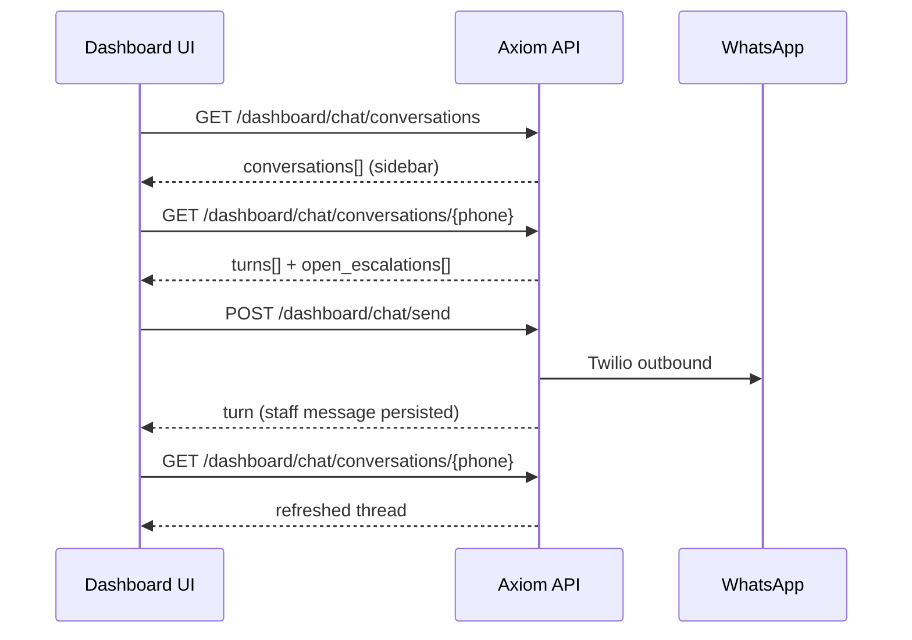

# Dashboard API Contract (Phase 5)

REST endpoints for the Next.js staff dashboard. All routes require `tenant_id` as a query parameter unless noted.

**Design decisions:** [PHASE5_DECISIONS.md](PHASE5_DECISIONS.md) — escalation-only HITL, no separate payments queue.

**Base URL (local):** `http://localhost:8000`

**Auth (MVP):** Backend uses Supabase service role. Dashboard frontend should use Supabase Auth + RLS in production; these dev endpoints are unauthenticated for hackathon demos.

---

## Tenant scope (required for all dashboard routes)

Every `/dashboard/*` and legacy `/escalations` endpoint validates the tenant **before** running any query. All database reads and writes use the resolved tenant id only — cross-tenant access returns **403**.

### How to pass tenant

Provide **one** of:

| Source | Example |
|--------|---------|
| Query param | `?tenant_id=tenant-demo-physics` |
| Header | `X-Tenant-ID: tenant-demo-physics` |

If both are sent, they **must match** or the API returns **400**.

For `POST` bodies that include `tenant_id` (e.g. chat send), the body value **must match** the resolved tenant or the API returns **403**.

### Validation errors

| Status | Meaning |
|--------|---------|
| **400** | No tenant provided, or query/header mismatch |
| **404** | Unknown `tenant_id` |
| **403** | Tenant exists but is not `active`, or body tenant mismatch |

### Recommended dashboard integration

After Supabase Auth login, resolve the staff user's `tenant_id` from `staff_users` and attach it to every API call:

```http
GET /dashboard/chat/conversations
X-Tenant-ID: tenant-demo-physics
Authorization: Bearer <supabase-jwt>
```

Local curl (query param is enough):

```bash
curl -s "http://localhost:8000/dashboard/overview?tenant_id=tenant-demo-physics"
```

---

## Escalation inbox (unified HITL queue)

Payment receipts and talk-to-tutor requests both appear as **escalations** with different `reason_code` values.

| Method | Path | Description |
|--------|------|-------------|
| GET | `/dashboard/escalations?tenant_id=` | List inbox items |
| PATCH | `/dashboard/escalations/{id}/resolve?tenant_id=` | Approve payment or close tutor ticket |
| PATCH | `/dashboard/escalations/{id}/reject?tenant_id=` | Reject payment (no enrollment) |

Legacy alias: `/escalations` (same handlers).

### Query params (list)

| Param | Values |
|-------|--------|
| `status` | `open`, `assigned`, `resolved` |
| `reason_code` | `payment_receipt`, `talk_to_tutor` |

### Escalation object

```json
{
  "id": "esc-uuid",
  "tenant_id": "tenant-demo-physics",
  "student_id": "stu-physics-001",
  "student_name": "Amaya Perera",
  "student_phone": "94771234567",
  "enrollment_id": "enr-uuid",
  "reason_code": "payment_receipt",
  "status": "open",
  "media_url": "https://...",
  "student_message": "Here is my payment",
  "resolution": null,
  "reviewed_by": null,
  "reviewed_at": null,
  "created_at": "2026-08-04T12:00:00Z",
  "updated_at": "2026-08-04T12:00:00Z"
}
```

### Resolve (approve payment / close tutor)

```http
PATCH /dashboard/escalations/{id}/resolve?tenant_id=tenant-demo-physics&notify=true&reviewed_by=staff@demo.com
```

**Payment (`payment_receipt`):** activates pending enrollment, marks invoice paid, sends enrollment success WhatsApp.

**Tutor (`talk_to_tutor`):** marks resolved only (`resolution=closed`).

Response:

```json
{
  "ok": true,
  "escalation_id": "esc-uuid",
  "reason_code": "payment_receipt",
  "resolution": "approved",
  "enrollment_status": "active",
  "student_notified": true,
  "notification_message": "Great news, Amaya! ..."
}
```

### Reject payment

```http
PATCH /dashboard/escalations/{id}/reject?tenant_id=tenant-demo-physics&notify=true&reviewed_by=staff@demo.com
```

Only valid for `reason_code=payment_receipt`. Does **not** activate enrollment. Sends rejection WhatsApp.

---

## Overview stats

```http
GET /dashboard/overview?tenant_id=tenant-demo-physics
```

```json
{
  "tenant_id": "tenant-demo-physics",
  "open_escalations": 2,
  "open_payment_receipts": 1,
  "open_talk_to_tutor": 1,
  "pending_enrollments": 1,
  "students": 42,
  "classes": 3
}
```

---

## Staff chat interface

Endpoints for the dashboard **conversation sidebar + thread panel + compose box** (same UX pattern as BookMe AI’s session list + message thread, adapted for WhatsApp student sessions).

### Endpoint map

| Method | Path | UI use |
|--------|------|--------|
| GET | `/dashboard/chat/conversations?tenant_id=` | **Sidebar** — list of student threads |
| GET | `/dashboard/chat/conversations/{phone}?tenant_id=` | **Thread panel** — full history + context |
| POST | `/dashboard/chat/send` | **Compose box** — staff → student WhatsApp |
| GET | `/dashboard/chat-logs?tenant_id=&phone=` | Legacy alias (turns only, no student/escalation context) |

### Integration flow (recommended)



1. **On load:** `GET /dashboard/chat/conversations?tenant_id=…&limit=50`
2. **On row click:** `GET /dashboard/chat/conversations/{phone}?tenant_id=…`
3. **On send:** `POST /dashboard/chat/send` then refresh thread (or append returned `turn`)
4. **Optional filter:** `open_escalation_only=true` on conversations list for an “needs attention” view
5. **From escalation inbox:** use `student_phone` from escalation row as `{phone}` for the thread

### Message sender labels

Each turn includes a `sender` field for bubble styling:

| `role` (DB) | `sender` (UI) | Meaning |
|-------------|---------------|---------|
| `user` | `student` | Incoming WhatsApp / dev chat |
| `assistant` | `bot` | AI agent reply |
| `system` | `staff` | Staff message via dashboard send |

### List conversations (sidebar)

```http
GET /dashboard/chat/conversations?tenant_id=tenant-demo-physics&limit=50&open_escalation_only=false
```

```json
{
  "tenant_id": "tenant-demo-physics",
  "conversations": [
    {
      "session_id": "tenant-demo-physics:94771234567",
      "student_id": "stu-physics-001",
      "student_name": "Amaya Perera",
      "phone": "94771234567",
      "last_message": "Here is my payment slip",
      "last_message_at": "2026-08-04T12:00:00Z",
      "last_sender": "student",
      "has_open_escalation": true,
      "open_escalation_reason": "payment_receipt"
    }
  ]
}
```

| Query param | Default | Description |
|-------------|---------|-------------|
| `limit` | `50` | Max conversations (1–200) |
| `open_escalation_only` | `false` | When `true`, only students with an open escalation |

### Get thread (message panel)

```http
GET /dashboard/chat/conversations/94771234567?tenant_id=tenant-demo-physics&limit=100
```

```json
{
  "tenant_id": "tenant-demo-physics",
  "session_id": "tenant-demo-physics:94771234567",
  "student_id": "stu-physics-001",
  "student_name": "Amaya Perera",
  "phone": "94771234567",
  "turns": [
    {
      "id": "turn-1",
      "role": "user",
      "sender": "student",
      "content": "Can I speak to sir?",
      "created_at": "2026-08-04T11:55:00Z"
    },
    {
      "id": "turn-2",
      "role": "assistant",
      "sender": "bot",
      "content": "We've notified your tutor…",
      "created_at": "2026-08-04T11:55:02Z"
    },
    {
      "id": "turn-3",
      "role": "system",
      "sender": "staff",
      "content": "Hi Amaya, I'll call you shortly.",
      "created_at": "2026-08-04T12:05:00Z"
    }
  ],
  "open_escalations": [
    {
      "id": "esc-uuid",
      "reason_code": "talk_to_tutor",
      "status": "open",
      "student_message": "Can I speak to sir?",
      "created_at": "2026-08-04T11:55:00Z"
    }
  ]
}
```

**404** if the phone is not registered as a student for the tenant.

Alias: `GET /dashboard/chat/threads/{phone}` (same response).

### Staff send

```http
POST /dashboard/chat/send?tenant_id=tenant-demo-physics
Content-Type: application/json
X-Tenant-ID: tenant-demo-physics

{
  "tenant_id": "tenant-demo-physics",
  "phone": "94771234567",
  "message": "Your payment was approved — welcome to class!",
  "staff_id": "staff@demo.com"
}
```

`tenant_id` in the query/header and in the body **must match**.

```json
{
  "ok": true,
  "tenant_id": "tenant-demo-physics",
  "phone": "94771234567",
  "delivered": true,
  "turn": {
    "id": "turn-uuid",
    "role": "system",
    "sender": "staff",
    "content": "Your payment was approved — welcome to class!",
    "created_at": "2026-08-04T12:10:00Z"
  }
}
```

- Message is **persisted before** Twilio send so the thread stays consistent.
- `staff_id` is optional (for future audit); not stored in MVP.
- In dev (`MESSAGING_DRY_RUN=true`), delivery is logged without Twilio.

### Legacy chat logs

```http
GET /dashboard/chat-logs?tenant_id=tenant-demo-physics&phone=94771234567
```

Same turn shape as thread, but **without** student metadata or `open_escalations`. Prefer `/dashboard/chat/conversations/{phone}` for new integrations.

---

## Student profile (thread header)

```http
GET /students/{phone}?tenant_id=tenant-demo-physics
```

Use alongside the thread endpoint to show enrollment status in the chat header.

---

## Student → agent flows (for E2E testing)

Use `POST /chat` (see [DEV_CHAT.md](DEV_CHAT.md)):

1. **Payment receipt:** include `media_url` after pending enrollment exists
2. **Talk to tutor:** `"Can I speak to sir?"`

---

## Document ingest (knowledge base)

Upload tutor PDFs into the tenant RAG collection. Chunks are **appended** to the existing Qdrant collection (`axiom_kb_{tenant_id}`); uploads do not wipe prior documents.

| Method | Path | Description |
|--------|------|-------------|
| POST | `/tools/ingest/upload` | Upload PDF → extract text → parent-child chunk → embed → upsert |

### Upload PDF

```http
POST /tools/ingest/upload
Content-Type: multipart/form-data
```

| Form field | Required | Description |
|------------|----------|-------------|
| `tenant_id` | yes | Tenant id, e.g. `tenant-demo-physics` |
| `file` | yes | Tutor note PDF (max 20 MB) |
| `title` | no | Document title for citations |
| `lesson` | no | Lesson label for citations |

Example:

```bash
curl -s -X POST "http://localhost:8000/tools/ingest/upload" \
  -F "tenant_id=tenant-demo-physics" \
  -F "title=Lesson 7 Notes" \
  -F "lesson=7" \
  -F "file=@lesson7.pdf;type=application/pdf"
```

Success response:

```json
{
  "ok": true,
  "tenant_id": "tenant-demo-physics",
  "strategy": "parent_child",
  "documents": 1,
  "chunks_upserted": 12,
  "collection": "axiom_kb_tenant_demo_physics",
  "points_count": 12,
  "document_title": "Lesson 7 Notes",
  "source_filename": "lesson7.pdf"
}
```

| Status | Meaning |
|--------|---------|
| **200** | PDF ingested successfully |
| **413** | File exceeds 20 MB limit |
| **422** | Missing `tenant_id`, non-PDF file, empty file, or unsupported content type |
| **500** | Ingest pipeline failure (extraction, embedding, or Qdrant upsert) |

The raw PDF is persisted under `data/uploads/{tenant_id}/` for audit. After upload, the RAG agent can retrieve chunks via `POST /tools/rag/search` or the `kb_search` MCP tool.

---

## MCP tools (agents)

| Tool | Purpose |
|------|---------|
| `create_escalation` | Open inbox item |
| `resolve_escalation` | Reason-aware resolve |
| `reject_payment_escalation` | Reject payment slip |

---

## Schema migration

Apply before first use:

```bash
make init-db
# or: psql "$SUPABASE_DB_URL" -f sql/02_phase5_escalations.sql
```

Adds to `escalations`: `media_url`, `student_message`, `resolution`, `reviewed_by`, `reviewed_at`.
