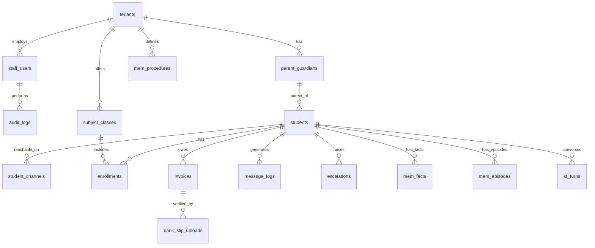

# Axiom AI — Database Documentation

**Version:** v2 (aligned with `docs/Technical Docs/Tutor AI ER.png`)  
**Engine:** Supabase PostgreSQL + pgvector  
**Source of truth:** `sql/01_schema.sql`

This document describes the multi-tenant relational schema used by the Axiom AI backend and the shared Supabase project consumed by the dashboard team.

---

## Overview

The database supports a Sri Lankan private-tuition SaaS platform:

- **Org & staff** — tenant configuration, staff roles, audit trail
- **Students & families** — students linked to parent/guardian contacts
- **Classes & enrollments** — subject offerings and student membership
- **Finance** — invoices and bank-slip OCR uploads
- **Messaging & escalations** — inbound intent logging and human handoff
- **Agent memory** — short-term turns, long-term facts/episodes, procedural workflows

All tenant-scoped tables carry a `tenant_id` foreign key to `tenants.id`. Application code must never query across tenants.

---

## Technology

| Component | Purpose |
|-----------|---------|
| **Supabase PostgreSQL** | Primary relational store |
| **pgcrypto** | UUID generation (`gen_random_uuid()`) |
| **pgvector** | Embeddings on memory tables (`vector(1536)`) |
| **PostgreSQL ENUMs** | Constrained status/type columns |
| **JSONB** | Flexible steps, tags, and episode turn payloads |

External vector search for RAG uses **Qdrant** (not stored in this schema).

---

## ER Diagram

Canonical diagram: [`docs/Technical Docs/Tutor AI ER.png`](Technical%20Docs/Tutor%20AI%20ER.png)



### ER entity → SQL table mapping

| ER Entity | SQL Table | Notes |
|-----------|-----------|-------|
| ORG_CONFIG | `tenants` | Org name, WhatsApp number, Drive folder merged into tenant row |
| STAFF_USER | `staff_users` | Dashboard staff (admin, marker, viewer) |
| AUDIT_LOG | `audit_logs` | Staff action audit trail |
| PARENT_GUARDIAN | `parent_guardians` | Financial sponsor / contact |
| STUDENT | `students` | Phone-identified learner |
| student_channel | `student_channels` | Telegram chat_id / WhatsApp number per student |
| SUBJECT_CLASS | `subject_classes` | Fee-bearing class offering |
| ENROLLMENT | `enrollments` | Student ↔ class membership |
| INVOICE | `invoices` | Billing period and amount due |
| BANK_SLIP_UPLOAD | `bank_slip_uploads` | OCR image + confidence score |
| MESSAGE_LOG | `message_logs` | Channel intent logging |
| ESCALATION | `escalations` | Human review queue |
| mem_procedures | `mem_procedures` | Onboarding / workflow rules |
| mem_facts | `mem_facts` | Long-term semantic memory |
| mem_episodes | `mem_episodes` | Session summaries |
| st_turns | `st_turns` | Short-term conversation turns |

---

## Multi-Tenancy

- **Root boundary:** `tenants.id` (TEXT, e.g. `tenant-demo-physics`)
- **Isolation rule:** Every query from application code filters by `tenant_id`
- **Inbound WhatsApp resolution:**
  1. Parse sender phone from Twilio webhook
  2. Resolve tenant via `tenants.whatsapp_number` (or sandbox mapping)
  3. Resolve student via `(tenant_id, phone)` on `students`
- **Dashboard access:** Supabase Auth + RLS policies scoped by `tenant_id` and `staff_users.role`
- **Backend access:** Service role key — bypasses RLS for agent writes

---

## ENUM Types

| PostgreSQL ENUM | Values | Python enum (`src/domain/enums.py`) |
|-----------------|--------|--------------------------------------|
| `tenant_status` | `active`, `suspended` | `TenantStatus` |
| `enrollment_status` | `active`, `paused`, `withdrawn` | `EnrollmentStatus` |
| `invoice_status` | `pending`, `paid`, `overdue`, `disputed` | `InvoiceStatus` |
| `escalation_status` | `open`, `assigned`, `resolved` | `EscalationStatus` |
| `message_role` | `user`, `assistant`, `system` | `MessageRole` |
| `chat_channel` | `twilio_whatsapp`, `telegram` | `ChatChannel` |
| `staff_role` | `admin`, `marker`, `viewer` | `StaffRole` |
| `fee_cycle` | `monthly`, `termly`, `annual` | `FeeCycle` |
| `payment_status` | `pending`, `approved`, `rejected` | `PaymentStatus` *(API legacy — bank-slip review)* |

---

## Tables

### `tenants` (ORG_CONFIG)

Root organization / tuition-agency record.

| Column | Type | Constraints | Description |
|--------|------|-------------|-------------|
| `id` | TEXT | PK | Tenant identifier |
| `name` | TEXT | NOT NULL | Display / org name |
| `slug` | TEXT | NOT NULL, UNIQUE | URL-safe slug |
| `status` | `tenant_status` | NOT NULL, default `active` | Account state |
| `whatsapp_number` | TEXT | | Twilio WhatsApp sender (e.g. `whatsapp:+14155238886`) |
| `drive_folder_id` | TEXT | | Google Drive root folder for resources |
| `bot_token` | TEXT | | Telegram Bot API token (per-tenant, not an env var) |
| `telegram_bot_username` | TEXT | | Bot username without `@` (e.g. `MrPereraTutorBot`) |
| `created_at` | TIMESTAMPTZ | NOT NULL | Row created |
| `updated_at` | TIMESTAMPTZ | NOT NULL | Row updated |

---

### `staff_users` (STAFF_USER)

Agency staff for dashboard and audit attribution.

| Column | Type | Constraints | Description |
|--------|------|-------------|-------------|
| `id` | TEXT | PK | Staff record ID |
| `tenant_id` | TEXT | FK → `tenants`, NOT NULL | Tenant scope |
| `role` | `staff_role` | NOT NULL, default `admin` | RBAC role |
| `name` | TEXT | NOT NULL | Display name |
| `created_at` | TIMESTAMPTZ | NOT NULL | Row created |

**Index:** `idx_staff_users_tenant (tenant_id)`

---

### `audit_logs` (AUDIT_LOG)

Immutable log of staff actions for compliance and support.

| Column | Type | Constraints | Description |
|--------|------|-------------|-------------|
| `id` | TEXT | PK | Log entry ID |
| `tenant_id` | TEXT | FK → `tenants`, NOT NULL | Tenant scope |
| `staff_id` | TEXT | FK → `staff_users`, NOT NULL | Actor |
| `action` | TEXT | NOT NULL | Verb (e.g. `approve_slip`, `resolve_escalation`) |
| `target_type` | TEXT | NOT NULL | Entity type (e.g. `invoice`, `escalation`) |
| `target_id` | TEXT | NOT NULL | Target record ID |
| `timestamp` | TIMESTAMPTZ | NOT NULL, default NOW() | When action occurred |

**Index:** `idx_audit_logs_tenant (tenant_id, timestamp DESC)`

---

### `parent_guardians` (PARENT_GUARDIAN)

Parent or guardian linked to one or more students.

| Column | Type | Constraints | Description |
|--------|------|-------------|-------------|
| `id` | TEXT | PK | Guardian record ID |
| `tenant_id` | TEXT | FK → `tenants`, NOT NULL | Tenant scope |
| `phone` | TEXT | NOT NULL | WhatsApp / contact number |
| `name` | TEXT | | Display name |
| `created_at` | TIMESTAMPTZ | NOT NULL | Row created |

**Unique:** `(tenant_id, phone)`  
**Index:** `idx_parent_guardians_tenant_phone (tenant_id, phone)`

---

### `students` (STUDENT)

Learner identified primarily by WhatsApp phone within a tenant.

| Column | Type | Constraints | Description |
|--------|------|-------------|-------------|
| `id` | TEXT | PK | Student record ID |
| `tenant_id` | TEXT | FK → `tenants`, NOT NULL | Tenant scope |
| `parent_id` | TEXT | FK → `parent_guardians`, SET NULL | Linked guardian |
| `name` | TEXT | | Full name |
| `phone` | TEXT | NOT NULL | WhatsApp number (E.164 without `+` recommended) |
| `district` | TEXT | | Sri Lankan district |
| `language_pref` | TEXT | default `en` | Preferred language code |
| `created_at` | TIMESTAMPTZ | NOT NULL | Row created |
| `updated_at` | TIMESTAMPTZ | NOT NULL | Row updated |

**Unique:** `(tenant_id, phone)`  
**Indexes:** `idx_students_tenant_phone`, `idx_students_parent`

Phone number (`phone`) is the durable student identifier. Telegram `chat_id` is stored on `student_channels`, not on this table.

---

### `student_channels`

Channel-specific delivery address for a student (Telegram chat, WhatsApp number, Demo UI).

| Column | Type | Constraints | Description |
|--------|------|-------------|-------------|
| `id` | TEXT | PK | Channel row ID |
| `tenant_id` | TEXT | FK → `tenants`, NOT NULL | Tenant scope |
| `student_id` | TEXT | FK → `students`, NOT NULL | Linked student |
| `channel` | `chat_channel` | NOT NULL | `telegram`, `twilio_whatsapp`, or `http_dev` |
| `channel_address` | TEXT | NOT NULL | Telegram `chat_id`, WhatsApp number, etc. |
| `is_primary` | BOOLEAN | NOT NULL, default `true` | Preferred channel for outbound |
| `created_at` | TIMESTAMPTZ | NOT NULL | Row created |

**Unique:** `(tenant_id, channel, channel_address)`, `(student_id, channel)`  
**Index:** `idx_student_channels_lookup (tenant_id, channel, channel_address)`

**Migration:** `sql/03_telegram_channel.sql`

---

### `subject_classes` (SUBJECT_CLASS)

Fee-bearing class offering (e.g. A/L Physics).

| Column | Type | Constraints | Description |
|--------|------|-------------|-------------|
| `id` | TEXT | PK | Class ID |
| `tenant_id` | TEXT | FK → `tenants`, NOT NULL | Tenant scope |
| `subject` | TEXT | NOT NULL | Subject name |
| `fee_amount` | NUMERIC(12,2) | NOT NULL, default 0 | Fee per cycle |
| `fee_cycle` | `fee_cycle` | NOT NULL, default `monthly` | Billing cadence |
| `created_at` | TIMESTAMPTZ | NOT NULL | Row created |
| `updated_at` | TIMESTAMPTZ | NOT NULL | Row updated |

**Index:** `idx_subject_classes_tenant (tenant_id)`

---

### `enrollments` (ENROLLMENT)

Links a student to a subject class.

| Column | Type | Constraints | Description |
|--------|------|-------------|-------------|
| `id` | TEXT | PK | Enrollment ID |
| `tenant_id` | TEXT | FK → `tenants`, NOT NULL | Tenant scope |
| `student_id` | TEXT | FK → `students`, NOT NULL | Enrolled student |
| `class_id` | TEXT | FK → `subject_classes`, NOT NULL | Target class |
| `status` | `enrollment_status` | NOT NULL, default `active` | Membership state |
| `created_at` | TIMESTAMPTZ | NOT NULL | Row created |

**Unique:** `(student_id, class_id)`  
**Index:** `idx_enrollments_tenant (tenant_id)`

---

### `invoices` (INVOICE)

Billing record for a student and period.

| Column | Type | Constraints | Description |
|--------|------|-------------|-------------|
| `id` | TEXT | PK | Invoice ID |
| `tenant_id` | TEXT | FK → `tenants`, NOT NULL | Tenant scope |
| `student_id` | TEXT | FK → `students`, NOT NULL | Billed student |
| `period` | TEXT | NOT NULL | Billing period (e.g. `2026-01`) |
| `amount_due` | NUMERIC(12,2) | NOT NULL | Amount in LKR |
| `status` | `invoice_status` | NOT NULL, default `pending` | Payment state |
| `created_at` | TIMESTAMPTZ | NOT NULL | Row created |
| `updated_at` | TIMESTAMPTZ | NOT NULL | Row updated |

**Index:** `idx_invoices_tenant_status (tenant_id, status)`

---

### `bank_slip_uploads` (BANK_SLIP_UPLOAD)

Student-submitted bank slip for invoice reconciliation.

| Column | Type | Constraints | Description |
|--------|------|-------------|-------------|
| `id` | TEXT | PK | Upload ID |
| `tenant_id` | TEXT | FK → `tenants`, NOT NULL | Tenant scope |
| `invoice_id` | TEXT | FK → `invoices`, NOT NULL | Linked invoice |
| `image_ref` | TEXT | NOT NULL | Storage URL or Drive/Twilio media ref |
| `confidence_score` | REAL | | OCR / fraud-check confidence (0–1) |
| `created_at` | TIMESTAMPTZ | NOT NULL | Row created |

**Index:** `idx_bank_slip_uploads_invoice (invoice_id)`

---

### `message_logs` (MESSAGE_LOG)

High-level log of inbound/outbound messaging intents (not full turn content).

| Column | Type | Constraints | Description |
|--------|------|-------------|-------------|
| `id` | TEXT | PK | Log ID |
| `tenant_id` | TEXT | FK → `tenants`, NOT NULL | Tenant scope |
| `student_id` | TEXT | FK → `students`, NOT NULL | Student |
| `channel` | `chat_channel` | NOT NULL, default `twilio_whatsapp` | Delivery channel |
| `intent` | TEXT | | Classified intent (e.g. `payment`, `doubt`, `admission`) |
| `timestamp` | TIMESTAMPTZ | NOT NULL, default NOW() | Event time |

**Index:** `idx_message_logs_tenant_student (tenant_id, student_id, timestamp DESC)`

---

### `escalations` (ESCALATION)

Unified human-in-the-loop inbox for Phase 5: payment receipts and talk-to-tutor requests. See [PHASE5_DECISIONS.md](PHASE5_DECISIONS.md).

| Column | Type | Constraints | Description |
|--------|------|-------------|-------------|
| `id` | TEXT | PK | Escalation ID |
| `tenant_id` | TEXT | FK → `tenants`, NOT NULL | Tenant scope |
| `student_id` | TEXT | FK → `students`, NOT NULL | Affected student |
| `enrollment_id` | TEXT | FK → `enrollments`, nullable | Linked pending enrollment (payment flow) |
| `reason_code` | TEXT | NOT NULL | `payment_receipt`, `talk_to_tutor`, … |
| `status` | `escalation_status` | NOT NULL, default `open` | Queue state |
| `media_url` | TEXT | nullable | Payment slip URL (Phase 5) |
| `student_message` | TEXT | nullable | Triggering message (Phase 5) |
| `resolution` | TEXT | nullable | `approved`, `rejected`, `closed` (Phase 5) |
| `reviewed_by` | TEXT | nullable | Staff audit (Phase 5) |
| `reviewed_at` | TIMESTAMPTZ | nullable | Staff audit (Phase 5) |
| `created_at` | TIMESTAMPTZ | NOT NULL | Row created |
| `updated_at` | TIMESTAMPTZ | NOT NULL | Row updated |

**Index:** `idx_escalations_tenant_status (tenant_id, status)`

**Migration:** `sql/02_phase5_escalations.sql`

---

## Memory Tables

Memory tables are partitioned by `tenant_id`. In `mem_facts`, `mem_episodes`, and `st_turns`, the column `user_id` references `students.id` (labeled `user_id` in the ER diagram).

### `mem_procedures`

Tenant-scoped procedural workflows (e.g. admissions onboarding).

| Column | Type | Description |
|--------|------|-------------|
| `id` | TEXT PK | Procedure ID |
| `tenant_id` | TEXT FK | Tenant scope |
| `name` | TEXT | Unique workflow key per tenant |
| `description` | TEXT | Human-readable summary |
| `steps` | JSONB | Ordered step definitions |
| `embedding` | vector(1536) | Semantic search vector |
| `active` | BOOLEAN | Whether workflow is live |
| `created_at` | TIMESTAMPTZ | Row created |

**Unique:** `(tenant_id, name)`

**Example `steps` payload:**

```json
[
  {"step": "greet", "prompt": "Welcome! Which class would you like to join?"},
  {"step": "name", "prompt": "What is your full name?"},
  {"step": "district", "prompt": "Which district are you from?"},
  {"step": "parent_phone", "prompt": "What is your parent/guardian WhatsApp number?"}
]
```

---

### `mem_facts`

Long-term semantic facts distilled from conversations.

| Column | Type | Description |
|--------|------|-------------|
| `id` | TEXT PK | Fact ID |
| `tenant_id` | TEXT FK | Tenant scope |
| `user_id` | TEXT FK → `students` | Student the fact belongs to |
| `text` | TEXT | Fact content |
| `embedding` | vector(1536) | Semantic vector |
| `score` | REAL | Relevance / confidence score |
| `tags` | JSONB | Optional categorization tags |
| `created_at` | TIMESTAMPTZ | Row created |

**Index:** `idx_mem_facts_tenant_user (tenant_id, user_id)`

---

### `mem_episodes`

Summarized conversation sessions for episodic recall.

| Column | Type | Description |
|--------|------|-------------|
| `id` | TEXT PK | Episode ID |
| `tenant_id` | TEXT FK | Tenant scope |
| `user_id` | TEXT FK → `students` | Student |
| `session_id` | TEXT | Conversation session key |
| `summary` | TEXT | LLM-generated session summary |
| `summary_embedding` | vector(1536) | Summary vector |
| `turns` | JSONB | Serialized turn snapshot |
| `created_at` | TIMESTAMPTZ | Row created |

**Index:** `idx_mem_episodes_session (tenant_id, session_id)`

---

### `st_turns`

Short-term memory — individual conversation turns within a session.

| Column | Type | Description |
|--------|------|-------------|
| `id` | TEXT PK | Turn ID |
| `tenant_id` | TEXT FK | Tenant scope |
| `user_id` | TEXT FK → `students` | Student |
| `session_id` | TEXT | Session key (not FK — sessions are logical) |
| `role` | `message_role` | `user`, `assistant`, or `system` |
| `content` | TEXT | Message body |
| `created_at` | TIMESTAMPTZ | Turn timestamp |

**Indexes:**
- `idx_st_turns_session (tenant_id, session_id, created_at DESC)`
- `idx_st_turns_user (tenant_id, user_id, created_at DESC)`

---

## Relationships Summary

```
tenants
 ├── staff_users ── audit_logs
 ├── parent_guardians ── students
 │                        ├── student_channels
 │                        ├── enrollments ── subject_classes
 │                        ├── invoices ── bank_slip_uploads
 │                        ├── message_logs
 │                        ├── escalations
 │                        ├── mem_facts
 │                        ├── mem_episodes
 │                        └── st_turns
 └── mem_procedures
```

**Cascade behavior:** Deleting a tenant removes all child rows (`ON DELETE CASCADE`). Deleting a parent guardian sets `students.parent_id` to NULL (`ON DELETE SET NULL`).

---

## SQL File Layout

| File | Purpose |
|------|---------|
| `sql/00_drop_legacy.sql` | Drops v1 tables before v2 migration |
| `sql/01_schema.sql` | Extensions, ENUMs, tables, indexes |
| `sql/02_seed_demo.sql` | Demo tenants and sample rows for hackathon |
| `sql/03_telegram_channel.sql` | Tenant bot token columns + `student_channels` |

Files are applied in lexical order by `scripts/init_supabase.py`.

---

## Setup & Migration

### Prerequisites

Set in `.env` (see `.env.example`):

```bash
SUPABASE_URL=https://<project>.supabase.co
SUPABASE_SERVICE_KEY=<service-role-key>
SUPABASE_DB_URL=postgresql://postgres.<ref>:<password>@<host>:6543/postgres
```

### Apply schema

```bash
make init-db
# or
PYTHONPATH=src python scripts/init_supabase.py
```

### Verify

```bash
make test   # includes tests/test_schema.py when SUPABASE_DB_URL is set
```

Schema tests assert:
- All 16 expected tables exist
- Legacy v1 tables are removed
- Demo seed rows are present

### Manual apply (Supabase SQL editor)

Run in order: `00_drop_legacy.sql` → `01_schema.sql` → `02_seed_demo.sql`.

> **Warning:** `00_drop_legacy.sql` drops application tables (not `tenants` data itself, but all dependent rows). Use only in dev or when intentionally resetting.

---

## Demo Seed Data

`sql/02_seed_demo.sql` creates two tenants for parallel team testing:

| Tenant ID | Slug | Sample student |
|-----------|------|----------------|
| `tenant-demo-physics` | `demo-physics` | Amaya Perera (`94771234567`) |
| `tenant-demo-chemistry` | `demo-chemistry` | Kavindu Silva (`94779876543`) |

Each tenant includes a parent guardian, subject class, enrollment, staff user, pending invoice, and an admissions `mem_procedures` workflow.

Local dev fallback tenant: `DEV_TENANT_ID=tenant-demo-physics` in `.env`.

---

## Legacy v1 Tables (removed)

These tables existed before the v2 ER alignment and are dropped by `00_drop_legacy.sql`:

| Removed Table | Replaced By |
|---------------|-------------|
| `tenant_integrations` | `tenants.drive_folder_id` |
| `classes` | `subject_classes` |
| `chat_sessions` | Logical `session_id` on `st_turns` / `mem_episodes` |
| `chat_logs` | `message_logs` + `st_turns` |
| `payments` | `invoices` + `bank_slip_uploads` |
| `procedures` | `mem_procedures` |

---

## Application Access Patterns

| Consumer | Auth | Typical tables |
|----------|------|----------------|
| AI backend (FastAPI) | Service role key | All tables — writes on `st_turns`, `message_logs`, memory |
| **Dev chat (`POST /chat`)** | None (local dev) | Same as WhatsApp — see [DEV_CHAT.md](DEV_CHAT.md) |
| Dashboard (frontend) | Supabase Auth + RLS | `staff_users`, `escalations`, `invoices`, `bank_slip_uploads` |
| Twilio webhook *(optional)* | Signature validation | `students`, `st_turns`, `message_logs` |

**Local development:** use `POST /chat` instead of Twilio — no sandbox setup required. See [DEV_CHAT.md](DEV_CHAT.md).

**Tenant resolution on inbound WhatsApp:**

```sql
SELECT s.*
FROM students s
JOIN tenants t ON t.id = s.tenant_id
WHERE s.phone = :from_phone
  AND t.whatsapp_number = :to_whatsapp_number
  AND t.status = 'active';
```

---

## Related Documentation

- [Phase 5 design decisions](PHASE5_DECISIONS.md) — escalation-only HITL rationale
- [Dashboard API contract](API_CONTRACT.md) — staff REST endpoints
- [Dev Chat (WhatsApp simulator)](DEV_CHAT.md) — local HTTP chat without Twilio
- [Tutor AI SRS v2](Tutor_AI_SRS_v2.md) — functional requirements
- [AI Backend Roadmap](Technical%20Docs/AI%20backend%20-%20Roadmap.md) — phase plan and API surface
- [Tutor AI ER Diagram](Technical%20Docs/Tutor%20AI%20ER.png) — visual schema reference
