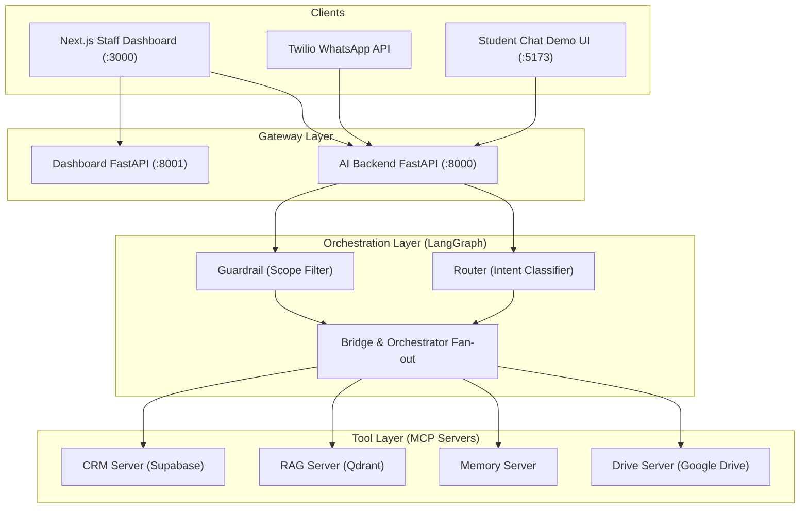
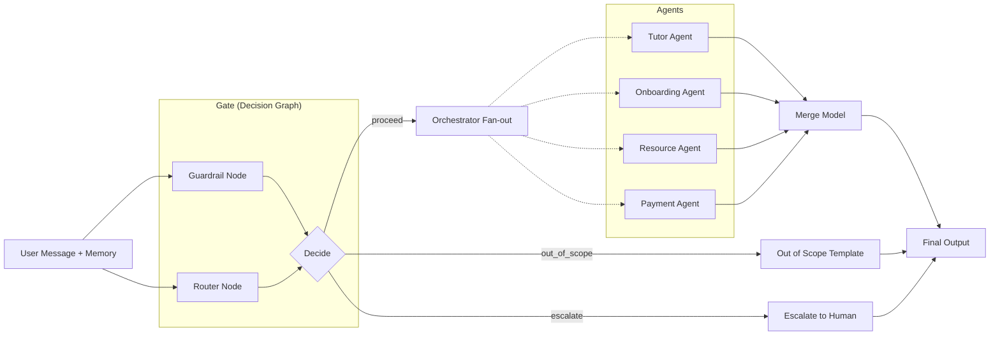

<p align="center">
  
  
  
  
  
  
</p>

# Axiom AI

> **MCP-based multi-tenant AI tutor platform powered by a parallel decision graph, LangGraph orchestrator, and real-time dashboard.**

Axiom AI is an intelligent tutoring system built on a modern AI architecture designed for Sri Lankan private tuition centers. It orchestrates multiple specialized AI agents through a LangGraph state machine to handle student inquiries, onboarding, resource retrieval, and payments. By utilizing the Model Context Protocol (MCP) and a parallel guardrail/router decision graph, Axiom AI delivers robust, scalable, and secure AI interactions across WhatsApp and web platforms.

---

## Table of Contents

- [Key Features](#-key-features)
- [System Architecture](#-system-architecture)
- [Agent Pipeline](#-agent-pipeline)
- [Memory System](#-memory-system)
- [Retrieval Strategies](#-retrieval-strategies)
- [Voice Pipeline](#-voice-pipeline)
- [MCP Servers (Tool Layer)](#-mcp-servers-tool-layer)
- [Tech Stack](#-tech-stack)
- [Project Structure](#-project-structure)
- [Instructions and Running](#-instructions-and-running)
- [Deployment](#-deployment)
- [CI/CD Pipeline](#-cicd-pipeline)
- [Configuration](#-configuration)
- [API Reference](#-api-reference)
- [Observability](#-observability)
- [License](#-license)

---

## ✨ Key Features

| Feature | Description |
|---|---|
| **Multi-Agent Orchestrator** | LangGraph fan-out to specialized agents (Tutor, Onboarding, Resource, Payment) to handle diverse student queries concurrently. |
| **Guardrail System** | Parallel LangGraph sub-graph that runs scope-filtering and routing simultaneously, rejecting out-of-scope non-educational queries instantly. |
| **Model Context Protocol (MCP)** | Standardized tool access via MCP stdio servers, decoupling LLM nodes from raw HTTP clients for external integrations (CRM, RAG, Memory, Drive). |
| **Multi-tenant Architecture** | Context and data isolated by `tenant_id` and student `phone` across Supabase, Qdrant, and Agent Memory. |
| **Next.js Staff Dashboard** | Dedicated frontend for tuition center staff to view metrics, manage students, escalate conversations, and ingest PDFs. |
| **Observability** | End-to-end tracing with LangFuse — prompt management, cost tracking, and detailed span analysis without needing a redeploy. |
| **WhatsApp Integration** | Seamlessly interact with students via Twilio WhatsApp webhooks, enabling learning on familiar platforms. |

---

## 🏗️ System Architecture

### High-Level Overview



---

## 🤖 Agent Pipeline

The core orchestration relies on a dual-state LangGraph implementation:


| Layer | Role | What It Does |
|---|---|---|
| **Gate (Decision Graph)** | Scope & Intent | Evaluates `in_scope` vs `out_of_scope` or `escalate`. If valid, routes to appropriate actions (`tutor`, `onboarding`, `resource`, `payment`). Guardrail and routing happen in parallel for zero added latency. |
| **Orchestrator** | Agent Execution | Takes the routed decisions and fans out to specialized MCP-backed agents. Combines their results using a merge model. |
| **Agents** | Tool usage | Tutor agents handle educational queries; Resource agents pull class materials via RAG; Onboarding and Payment handle CRM updates. |

---

## 🧠 Memory System

Axiom AI relies on an efficient, thread-safe memory architecture:

- **SessionStore**: Context is isolated by `(tenant_id, phone)` ensuring complete privacy between concurrent users.
- **Configurable Context**: Controlled by system settings, dictating `max_turns` and `history_window` to stay well within token limits.
- **MCP Memory Server**: Enables agents to explicitly store and recall long-term facts about a student's learning progress across sessions.

---

## 🔍 Retrieval Strategies

| Strategy | Description | Use Case |
|---|---|---|
| **RAG Tool Calling** | Direct vector lookup via MCP servers to Qdrant. | Retrieving specific class materials and past papers. |
| **Google Drive Search** | Accessing documents directly from the tuition center's Google Drive. | Exploring external syllabi or shared teaching materials dynamically. |

---

## 🎙️ Voice Pipeline

*This feature is currently **Planned for Future Phases**.*
Future iterations will introduce a real-time voice pipeline for hands-free tutoring, allowing students to verbally interact with the AI tutor.

---

## 🔧 MCP Servers (Tool Layer)

The agent's tools are securely exposed via **Model Context Protocol (MCP)** stdio servers:

| MCP Server | Tools | Backend |
|---|---|---|
| **CRM Server** | `get_student`, `enroll_student`, `check_payment` | Supabase HTTP endpoints / Database |
| **RAG Server** | `search_materials`, `get_answers` | Qdrant Vector Database |
| **Memory Server**| `store_fact`, `recall_fact` | Persistent session store |
| **Drive Server** | `search_drive`, `download_file` | Google Drive API |

---

## 🛠️ Tech Stack

### Backend
| Component | Technology |
|---|---|
| Framework | **FastAPI** (async, ASGI) |
| Agent Orchestration | **LangGraph** & **LangChain** |
| Tool Standard | **MCP** (`langchain-mcp-adapters`) |
| Observability | **LangFuse** (tracing, prompt management) |
| Database | **Supabase** (PostgreSQL) |
| Vector Store | **Qdrant Cloud** |

### Frontend
| Component | Technology |
|---|---|
| Framework | **Next.js 16** + **React 19** |
| Build Tool | **Vite** (for Demo UI) |
| Styling | **Tailwind CSS** |

---

## 📁 Project Structure

```
Axiom-AI/
│
├── AI-backend/                   # 🤖 Multi-agent FastAPI backend
│   ├── src/                      #    Agent orchestration, routers, MCP tools
│   ├── docs/                     #    Setup and architecture documentation
│   ├── tests/                    #    Pytest suite for agents and schemas
│   └── demo-ui-org/              #    WhatsApp student chat demo UI
│
├── Dashboard/                    # 💻 Next.js staff dashboard & API
│   ├── frontend/                 #    Next.js frontend (:3000)
│   └── backend/                  #    FastAPI dashboard API (:8001)
│
├── graphify-out/                 # 📊 Graph representations
├── logs/                         # 📝 System logs
├── LICENSE
├── Makefile
└── README.md
```

---

## 🚀 Instructions and Running

### Live Demos & Links

- **Chat Demo UI**: [https://axiom-ai-nine-blue.vercel.app](https://axiom-ai-nine-blue.vercel.app)
- **Dashboard**: [https://axiom-dashboard-xi.vercel.app](https://axiom-dashboard-xi.vercel.app)
- **API Backend**: [https://axiom.178.128.17.103.sslip.io](https://axiom.178.128.17.103.sslip.io)

---

### Running the System Locally

#### Prerequisites

| Tool | Version |
|------|---------|
| Python | 3.11+ (Required for MCP stdio servers) |
| Node.js | 18+ (npm) |
| Supabase | Cloud or Local project |

---

#### 1. Backend (AI Agents & MCP)

```bash
cd AI-backend
cp .env.example .env   # set OPENAI_API_KEY, SUPABASE_*, QDRANT_*
make venv
source .venv/bin/activate
make init-db
make run               # Runs on http://localhost:8000
```

#### 2. Dashboard Backend

```bash
cd Dashboard/backend
python -m venv venv
source venv/bin/activate
pip install -r requirements.txt
uvicorn app.main:app --reload --port 8001
```

#### 3. Dashboard Frontend

```bash
cd Dashboard/frontend
npm install
npm run dev            # Runs on http://localhost:3000
```

#### 4. Student Chat Demo UI

```bash
cd AI-backend
make demo-ui           # Runs on http://localhost:5173
```

> **Note:** The Next.js frontend expects the Dashboard backend on port `8001` and the AI backend on port `8000`.

---

## ☁️ Deployment

- **Frontend:** Next.js application deploys easily to Vercel.
- **Backend APIs:** Both AI-backend and Dashboard backend can be deployed on a DigitalOcean Droplet via Docker Compose.
- **Databases:** Supabase handles PostgreSQL relational data, while Qdrant Cloud hosts the vector store.

---

## 🔄 CI/CD Pipeline

Standard pipeline configurations run on push to `main`:
- Validation of Pytest test suite (`make test`) and agent smoke tests (`make smoke-phase6`).
- Automatic containerization and push to Docker Hub.
- Rollout to staging droplets and Vercel environments.

---

## ⚙️ Configuration

Runtime behavior is easily controlled via `.env` files and system configurations:

- **AI-backend/.env**: Toggle `AGENT_USE_MCP=true` to enable MCP subprocesses. Adjust `MESSAGING_DRY_RUN` to disable live Twilio outputs.
- **LangFuse**: Prompts can be dynamically updated using `LANGFUSE_PROMPT_LABEL=production` without redeploying code.

---

## 📡 API Reference

### AI Backend (`:8000`)
| Endpoint | Method | Description |
|---|---|---|
| `/health` | `GET` | API Liveness check |
| `/ready` | `GET` | Config + MCP tool readiness check |
| `/chat` | `POST` | Core messaging endpoint for WhatsApp / demo UI |

### Dashboard Backend (`:8001`)
| Endpoint | Method | Description |
|---|---|---|
| `/dashboard/overview` | `GET` | Fetch top-level dashboard metrics |
| `/dashboard/escalations` | `GET` | Retrieve conversations escalated to staff |

---

## 📊 Observability

Axiom AI uses **LangFuse** (`@observe`) for comprehensive observability:
- **Prompt Management:** System prompts are fetched from LangFuse (or local fallbacks) to allow hot-editing without redeploys.
- **Tracing:** Complete span visibility across the decision graph and MCP agent fan-out.
- **Token Tracking:** Usage tracked for every LLM interaction, organized by tenant ID.

---

## 📄 License

This project is proprietary software. All rights reserved.

---

<p align="center">
  Built with ❤️
</p>
