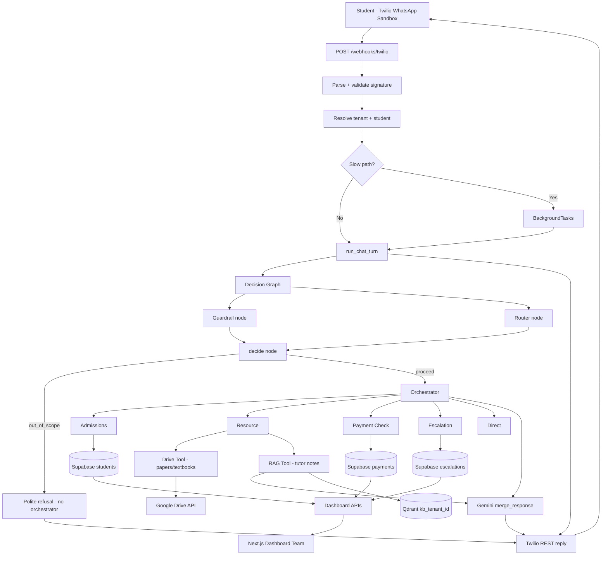

# Axiom AI — AI Backend Roadmap

> **Scope:** Hackathon MVP (6 days) · AI backend only · Multi-tenant SaaS for Sri Lankan private tuition  
> **Owner:** AI backend team · **Consumers:** Twilio (students), Next.js staff dashboard (frontend team)  
> **Last updated:** 2026-08-04 (GPT-4o-mini + Gemini merge; status enums; Langfuse tracing + prompt management)

This document replaces the generic agentic-AI template (`Roadmap.md`). It is the single source of truth for **what we build, in what order, and why**.

---

## Table of Contents

1. [Locked Architecture Decisions](#1-locked-architecture-decisions)
2. [LLM Model Strategy](#2-llm-model-strategy)
3. [Status Enums & Domain Types](#3-status-enums--domain-types)
4. [Langfuse Observability & Prompt Management](#4-langfuse-observability--prompt-management)
5. [System Understanding](#5-system-understanding)
6. [Resource Split: Google Drive vs RAG](#6-resource-split-google-drive-vs-rag)
7. [Multi-Tenant Data Model](#7-multi-tenant-data-model)
8. [Reference Patterns to Reuse](#8-reference-patterns-to-reuse)
9. [High-Level Architecture](#9-high-level-architecture)
10. [Phased Implementation Plan](#10-phased-implementation-plan)
11. [API Contract Summary (Dashboard Team)](#11-api-contract-summary-dashboard-team)
12. [Environment Variables](#12-environment-variables)
13. [Explicitly Out of MVP Scope](#13-explicitly-out-of-mvp-scope)
14. [Per-Phase Workflow](#14-per-phase-workflow)
15. [Day-by-Day Schedule](#15-day-by-day-schedule)
16. [Future Implementations (V2)](#16-future-implementations-v2)

---

## 1. Locked Architecture Decisions

These decisions are **final for the MVP**. Do not reintroduce removed components without team agreement.

| Decision | Choice | Rationale |
|----------|--------|-----------|
| **Messaging channel** | **Twilio WhatsApp Sandbox** | Matches student UX (WhatsApp) without Meta Business API complexity; good for hackathon demo |
| **Not using** | Meta WhatsApp Cloud API, Telegram, Twilio SMS | Out of MVP scope |
| **Message queue** | **None — no Redis** | Simpler ops; Twilio allows ~15s webhook timeout; use FastAPI `BackgroundTasks` for slow paths |
| **Worker process** | **None** | Processing runs in the FastAPI process (sync or background) |
| **Database** | **Shared Supabase project** | Same PostgreSQL instance for AI backend + dashboard team; RLS for tenant isolation |
| **Tenancy** | **Multi-tenant from day one** | Per ER diagram (`tenants` as isolation boundary); every query filtered by `tenant_id` |
| **Memory (MVP)** | **ST memory + procedural only** | Session turns in Supabase; onboarding workflow rules; no LT semantic / episodic / distiller |
| **Payments** | **Manual staff review** | Payment Check Agent creates dashboard queue item; no bank-slip OCR in MVP |
| **Google Drive content** | **Tutes + textbooks only** | Past papers, model papers, textbook PDFs — file retrieval via Drive tool |
| **RAG content** | **Tutor notes only** | Lesson notes, explanations, teaching methodology — semantic Q&A via Qdrant |
| **Drive integration (MVP)** | **Direct Python tool first** | Google Drive API scoped per tenant; MCP server wrapper deferred to v2 if time allows |
| **Frontend** | **Not in this repo** | Staff dashboard built separately; we expose REST APIs + OpenAPI |
| **Decision graph** | **BookMe-AI pattern: guardrail ∥ router → decide** | Scope filter before expensive agent/tool calls; no semantic cache layer |
| **Not using** | **CAG, CRAG, semantic cache** | Week 13 cache path removed from MVP; FAQ/admin queries go through RAG or direct agent |
| **Primary chat model** | **OpenAI GPT-4o-mini** (`gpt-4o-mini`) | Main specialist agent replies, admissions turns, direct/concierge responses |
| **Merge / synthesis model** | **Google Gemini** (`gemini-2.5-flash`) | Combining parallel agent outputs, RAG answer synthesis, final reply merge after multi-step flows |
| **Status fields** | **PostgreSQL ENUM types + Python `StrEnum`** | Typed statuses in DB and API — no raw string literals in application code |
| **Observability** | **Langfuse — tracing + prompt management (MVP)** | Per-tenant/session/user traces; prompts fetched from Langfuse, not hardcoded in repo |
| **Implementation docs** | **Context7 MCP** | Fetch current Langfuse, OpenAI, Gemini SDK docs during each phase — do not rely on stale patterns |

---

## 2. LLM Model Strategy

### Model Assignments (Locked for MVP)

| Role | Model | Provider | Used in |
|------|-------|----------|---------|
| **Chat / specialist agents** | `gpt-4o-mini` | OpenAI (direct) or OpenRouter (`openai/gpt-4o-mini`) | Admissions, Resource Q&A, Direct, Payment/Escalation copy |
| **Merge / synthesis** | `gemini-2.5-flash` | Google (`GOOGLE_API_KEY`) or OpenRouter (`google/gemini-2.5-flash`) | `merge_responses`, RAG final synthesis, multi-step reply consolidation |
| **Router** | `llama-3.3-70b-versatile` | Groq | Fast intent JSON classification |
| **Guardrail** | `llama-3.3-70b-versatile` | Groq | Fast in-scope / out-of-scope binary check |
| **Extractor** | `llama-3.1-8b-instant` | Groq | Structured field extraction (onboarding slots) |
| **Embeddings** | `text-embedding-3-small` | OpenAI / OpenRouter | Qdrant ingest (Phase 4) |

### Why Two Models?

- **GPT-4o-mini** — reliable conversational quality for student-facing tuition dialogue at low cost.
- **Gemini** — strong at synthesising multiple context blocks (guardrail verdict + router intent + RAG chunks + tool results) into one coherent WhatsApp reply without losing citations.

### Merge Points (Gemini)

| Flow | Merge behaviour |
|------|-----------------|
| Decision graph | Guardrail + router run in parallel; **decide** is rule-based (no LLM). Gemini used **after** orchestrator when multiple tool/agent fragments need one reply |
| Resource Agent (RAG) | Retrieve chunks → **Gemini synthesises** grounded answer with tutor-note citations |
| Multi-step onboarding | Collect slots across turns → **Gemini merges** confirmation message |
| Compound messages (stretch) | If two specialists both contribute partial answers → **Gemini merge** (single-route MVP; full fan-out → V2) |

### Config Files

```yaml
# config/models.yaml — chat vs merge split
openai:
  chat:
    general: gpt-4o-mini          # primary chat
google:
  chat:
    general: gemini-2.5-flash     # merge / synthesis
```

```python
# src/infrastructure/llm/llm_provider.py
get_chat_llm()        # → gpt-4o-mini
get_merge_llm()       # → gemini-2.5-flash  (NEW factory)
get_router_llm()      # → groq fast
get_guardrail_llm()   # → groq fast
```

**Implementation note:** Use **Context7 MCP** (`resolve-library-id` → `query-docs`) for OpenAI Python SDK, Google Gemini / LangChain integration, and Langfuse `@observe` + `propagate_attributes` when wiring these factories.

---

## 3. Status Enums & Domain Types

Replace free-text `CHECK (status IN (...))` columns with **PostgreSQL ENUM types** and mirror them as **Python `StrEnum`** classes for API schemas, DB clients, and agent logic.

### PostgreSQL ENUM Types (`sql/01_schema.sql`)

```sql
CREATE TYPE tenant_status       AS ENUM ('active', 'suspended');
CREATE TYPE enrollment_status   AS ENUM ('active', 'paused', 'withdrawn');
CREATE TYPE payment_status      AS ENUM ('pending', 'approved', 'rejected');
CREATE TYPE escalation_status   AS ENUM ('open', 'assigned', 'resolved');
CREATE TYPE escalation_urgency  AS ENUM ('low', 'normal', 'high');
CREATE TYPE chat_direction      AS ENUM ('inbound', 'outbound');
CREATE TYPE message_role        AS ENUM ('user', 'assistant', 'system');
CREATE TYPE chat_channel        AS ENUM ('twilio_whatsapp');
CREATE TYPE staff_role          AS ENUM ('admin', 'marker', 'viewer');
```

### Python Enums (`src/domain/enums.py`)

```python
from enum import StrEnum

class TenantStatus(StrEnum):
    ACTIVE = "active"
    SUSPENDED = "suspended"

class PaymentStatus(StrEnum):
    PENDING = "pending"
    APPROVED = "approved"
    REJECTED = "rejected"
# … mirror all DB enums
```

### Rules

1. **DB columns** use ENUM types — not `TEXT` + inline `CHECK`.
2. **Pydantic schemas** (`src/api/schemas.py`) reference `StrEnum` — OpenAPI shows allowed values.
3. **Agent / service code** compares against enum members — never `"pending"` string literals.
4. **Dashboard PATCH bodies** validate against enums; invalid value → `422`.
5. **Migration:** update `sql/01_schema.sql` before first shared Supabase apply; add `sql/03_enums_migration.sql` if schema already live.

### Enum ↔ Langfuse Tags

Map enum values to trace metadata for filtering in Langfuse UI:

| Metadata key | Source | Example |
|--------------|--------|---------|
| `tenant_id` | Identity context | `tenant-demo-physics` |
| `payment_status` | Payment agent | `pending` |
| `escalation_urgency` | Escalation agent | `high` |

---

## 4. Langfuse Observability & Prompt Management

Langfuse is **required for MVP**, not a skeleton. Phase 0 ships the client; Phase 2+ wires full tracing and remote prompts.

### Tracing — Per Tenant, Session, User

Every `run_chat_turn()` creates one Langfuse **trace** scoped to the WhatsApp conversation:

| Langfuse field | Axiom mapping | Purpose |
|----------------|---------------|---------|
| `session_id` | `chat_sessions.id` | Session replay — all turns in one thread |
| `user_id` | `students.id` (or phone hash pre-registration) | User-level analytics |
| `metadata.tenant_id` | `tenants.id` | Multi-tenant filtering |
| `metadata.tenant_slug` | `tenants.slug` | Human-readable dashboards |
| `tags` | `["tenant:{slug}", "channel:twilio_whatsapp"]` | Filter traces by tutor |
| `name` | `chat_turn` | Top-level span |

**SDK pattern** (from Langfuse docs via Context7):

```python
from langfuse import observe, propagate_attributes

@observe(name="chat_turn")
async def run_chat_turn(ctx: IdentityContext, message: str) -> str:
    with propagate_attributes(
        session_id=ctx.session_id,
        user_id=ctx.student_id or ctx.phone,
        tags=[f"tenant:{ctx.tenant_slug}", "channel:twilio_whatsapp"],
        metadata={"tenant_id": ctx.tenant_id, "human_mode": ctx.human_mode},
    ):
        # decision graph + orchestrator spans nest automatically
        ...
```

**Nested spans** (each graph node + LLM call):

| Span name | Phase | Notes |
|-----------|-------|-------|
| `decision_graph` | 2 | Parent for guardrail ∥ router |
| `guardrail` | 2 | Include verdict in output |
| `router` | 2 | Include intent JSON |
| `decide` | 2 | Rule-based; log verdict |
| `orchestrator` | 2–5 | Agent dispatch |
| `admissions` / `resource` / … | 3–5 | Specialist nodes |
| `rag_retrieve` / `drive_search` | 4 | Tool spans |
| `merge_response` | 2+ | Gemini synthesis span |
| `twilio_send` | 1 | Outbound message |

**LLM generations** — attach `langfuse_session_id`, `langfuse_user_id`, `langfuse_tags` via LangChain callback handler or `propagate_attributes` so token usage rolls up to the session.

### Prompt Management — Langfuse as Source of Truth

Prompts are **not** hardcoded in `src/agents/prompts/` for production paths. Langfuse stores versioned prompts; code fetches and compiles at runtime.

| Prompt name (Langfuse) | Type | Variables | Used by |
|------------------------|------|-----------|---------|
| `axiom/guardrail` | text | — | Guardrail classifier |
| `axiom/router` | chat | `router_context` placeholder | Router intent |
| `axiom/out_of_scope_reply` | text | — | Decide short-circuit |
| `axiom/admissions` | chat | `student`, `classes`, `chat_history` | Admissions agent |
| `axiom/resource_rag` | chat | `chunks`, `question` | Resource RAG synthesis (→ Gemini) |
| `axiom/resource_drive` | text | `file_name`, `link` | Drive file delivery template |
| `axiom/payment_ack` | text | `student_name` | Payment receipt ack |
| `axiom/escalation_ack` | text | — | Escalation handoff message |
| `axiom/merge_response` | chat | `fragments`, `chat_history` | Gemini merge |
| `axiom/direct` | chat | `chat_history` | Concierge / greetings |

**Fetch pattern:**

```python
from langfuse import get_client

langfuse = get_client()
prompt = langfuse.get_prompt("axiom/router", label="production")
messages = prompt.compile(router_context=ctx.build_router_context())
```

**Versioning & labels:**

- `production` — live hackathon demo
- `staging` — team testing before promote
- Per-tenant overrides (stretch): label `tenant:{slug}` on prompt version; fallback chain: tenant label → `production`

**Local fallback:** `src/agents/prompts/tutoring_prompts.py` holds **seed copies only** for offline dev when Langfuse keys absent; log warning and use local fallback.

### Phase Deliverables for Langfuse

| Phase | Langfuse work |
|-------|---------------|
| 0 | Client init, `observe` decorator, `flush()` on shutdown, env vars |
| 1 | Trace inbound webhook → outbound send; tag with tenant |
| 2 | Full decision graph spans; seed prompts in Langfuse project |
| 3–5 | Agent-specific prompts + generations linked to session |
| 6 | E2E trace review; prompt promote workflow documented in SETUP.md |

### Environment

```bash
LANGFUSE_PUBLIC_KEY=
LANGFUSE_SECRET_KEY=
LANGFUSE_HOST=https://cloud.langfuse.com   # or self-hosted
```

---

## 5. System Understanding

### Business Problem

Private tutors in Sri Lanka manage hundreds of students through unstructured WhatsApp groups. Repetitive questions, manual onboarding, hard-to-find resources, and payment verification overwhelm small admin teams.

### MVP Solution (AI Backend)

A **Twilio WhatsApp Sandbox** agent that:

1. **Admits** new students (Admissions Agent + procedural onboarding)
2. **Retrieves** past papers and textbooks from **Google Drive** (Resource Agent — file delivery)
3. **Answers** conceptual questions from **tutor notes** via **RAG** (Resource Agent — Qdrant)
4. **Routes** payment receipts and angry/complex messages to the **staff dashboard** (Payment Check + Escalation agents)
5. **Isolates** every tutor's data by `tenant_id` (multi-tenant)

### Success Metrics (from MVP Definition)

- **>75%** routine message deflection (no human needed)
- Staff confirms payment or takes over chat in **<3 clicks** (dashboard APIs)
- Stable Twilio delivery with no dropped context

### Agent Roster (MVP — 4 specialists + router)

| Agent | MVP | Responsibility |
|-------|-----|----------------|
| Admissions Agent | ✅ | Registration, onboarding, PDPA consent, class enrollment |
| Resource Agent | ✅ | Drive file lookup (papers/textbooks) + RAG answers (tutor notes) |
| Payment Check Agent | ✅ | Detect payment intent + image → `payments` row (`pending`) |
| Escalation Agent | ✅ | Frustration / low-confidence → `escalations` row |
| Direct / Concierge | ✅ | Greetings, simple FAQ within scope |
| Academic Assistant (full) | ❌ v2 | Deep step-by-step tutoring |
| Finance OCR / Grading / Marketing | ❌ v2 | Per MVP Definition exclusions |

---

## 6. Resource Split: Google Drive vs RAG

This split is **confirmed** and matches `docs/Project Planning.md` Use Cases 1 and 2.

### Google Drive — Tutes & Textbooks Only

**Purpose:** Send the **actual file or link** when a student asks for a document.

| Content type | Examples | Storage |
|--------------|----------|---------|
| Past papers / tutes | "Last week's physics paper", "2024 model paper" | Google Drive |
| Textbooks | Syllabus PDFs, reference book chapters | Google Drive |
| Lecture links | YouTube / Drive video links (metadata in Drive) | Google Drive |

**Not in Drive (MVP):** Tutor lesson notes, explanations, FAQ text — these belong in RAG.

**Per-tenant folder convention:**

```text
/{tenant_drive_root}/
  papers/          ← past papers, model papers, tutes
  textbooks/       ← textbook PDFs
  syllabus/        ← optional: class rules, intro packs
```

**Tool behavior:** Resource Agent sub-route `drive_search` → returns shareable link or Twilio media message. All searches filtered by `tenant_id` → mapped `drive_folder_id` in Supabase (`tenant_integrations`).

**MVP implementation note:** Use **Google Drive API** with a service account or one OAuth connection per demo tenant. Store `drive_root_folder_id` per tenant in Supabase. Wrap as `DriveTool.dispatch(action, params)`; add MCP server only if time permits in Phase 4.

### RAG (Qdrant) — Tutor Notes Only

**Purpose:** **Answer questions** grounded in how the tutor teaches — not deliver raw PDFs.

| Content type | Examples | Storage |
|--------------|----------|---------|
| Lesson notes | "Explain velocity from lesson 5" | Qdrant (`kb_{tenant_id}`) |
| Teaching methodology | Step-by-step style from tutor's materials | Qdrant |
| FAQ-style note chunks | "When is the exam?" (stored as tutor notes in Qdrant) | Qdrant |

**Not in RAG:** Full textbook PDFs or past papers (too large; use Drive for those).

**Ingest sources (MVP):**

1. Admin uploads markdown/text via script: `scripts/ingest_tenant_notes.py --tenant-id X --path data/knowledge_base/{tenant_id}/`
2. Optional: dedicated `notes/` folder synced on schedule (v2); for hackathon, **manual ingest is enough**

**Router disambiguation:**

| Student message | Route | Tool |
|-----------------|-------|------|
| "Can I get last week's physics paper?" | `resource` → `drive` | Google Drive |
| "I don't understand velocity in lesson 5" | `resource` → `rag` | Qdrant RAG |
| "Send me the textbook for chapter 3" | `resource` → `drive` | Google Drive |
| "What did sir say about Newton's laws?" | `resource` → `rag` | Qdrant RAG |

---

## 7. Multi-Tenant Data Model

Aligned with `docs/Tutor_AI_SRS_v2.md` §11 and ER diagram (`docs/Technical Docs/Tutor AI ER.png`).

### Core Entities

| Entity | Key fields | Isolation |
|--------|------------|-----------|
| `tenants` | `id`, `name`, `slug`, `status` (`tenant_status` ENUM), `twilio_whatsapp_number` | Root boundary |
| `tenant_integrations` | `tenant_id`, `drive_root_folder_id`, `drive_credentials_ref` | 1:1 tenant |
| `classes` | `id`, `tenant_id`, `name`, `subject`, `grade`, `fee_amount` | FK `tenant_id` |
| `students` | `id`, `tenant_id`, `phone` (unique per tenant), `name`, `school`, `district`, `consent_at` | FK `tenant_id` |
| `enrollments` | `student_id`, `class_id`, `status` (`enrollment_status` ENUM) | Via student/class |
| `staff_users` | `id`, `tenant_id`, `email`, `role` (`staff_role` ENUM) | Dashboard auth (frontend) |
| `chat_sessions` | `id`, `tenant_id`, `student_id`, `channel` (`chat_channel` ENUM), `human_mode` | FK `tenant_id` |
| `chat_logs` | `tenant_id`, `session_id`, `direction` (`chat_direction` ENUM), `body`, `media_url` | FK `tenant_id` |
| `st_turns` | `tenant_id`, `session_id`, `role` (`message_role` ENUM), `content` | Short-term memory |
| `payments` | `tenant_id`, `student_id`, `status` (`payment_status` ENUM), `media_url`, `reviewed_by`, `reviewed_at` | FK `tenant_id` |
| `escalations` | `tenant_id`, `student_id`, `urgency` (`escalation_urgency` ENUM), `status` (`escalation_status` ENUM), `sla_due_at` | FK `tenant_id` |
| `procedures` | `tenant_id`, `workflow_key`, `steps_json` | Onboarding rules |

### Tenant Resolution (Inbound Twilio)

1. Parse `From` (WhatsApp number) on webhook
2. Resolve `tenant_id` via `tenants.twilio_whatsapp_number` or sandbox mapping table
3. Resolve `student` via `(tenant_id, phone)`
4. Pass `IdentityContext(tenant_id, student_id, class_ids, role)` into `run_chat_turn()`

**Rule:** Never read `DEFAULT_TENANT_ID` from env in production paths — only for local dev fallback.

### Shared Supabase for Dashboard Team

- **One Supabase project** shared between AI backend and dashboard developers
- AI backend uses **service role** for writes; dashboard uses **Supabase Auth + RLS** policies scoped by `tenant_id` and `staff_users.role`
- Provide `.env.example` with `SUPABASE_URL`, `SUPABASE_SERVICE_KEY` (backend) and document that dashboard uses `SUPABASE_ANON_KEY` + RLS
- Schema migrations live in `sql/` — dashboard team applies same migrations or uses shared Supabase CLI

---

## 8. Reference Patterns to Reuse

| Source | Reuse | Skip |
|--------|-------|------|
| **Week 13** | Folder layout, `main.py` lifespan, `deps.py`, router, orchestrator, **plain RAG service** (no CAG/CRAG), config YAML | Hospital CRM, **CAG cache, CRAG, CAG decision node**, MCP servers (defer), 4-tier memory |
| **BookMe AI** | **`decision_graph.py`**, **`guardrail.py`**, `decision_state` + `decision_bridge`, `chat_pipeline.py`, `build_decision_graph()`, `decide_node`, SessionStore pattern → Supabase `st_turns` | Travel tools, Clerk auth, Redis |
| **Axiom AI (reference)** | Config, LLM factories, Qdrant client, ingest pipeline, identity schema | WhatsApp webhook, Redis queue, worker |
| **Hackathon docs** | SRS, MVP Definition, Project Planning, ER diagram | Meta WhatsApp flows |
| **Context7 MCP** | Langfuse `@observe` + `propagate_attributes`, OpenAI/Gemini SDK patterns, prompt `get_prompt` / `compile` | — |

---

## 9. High-Level Architecture



### Processing Model (No Redis)

| Path | Pattern | When |
|------|---------|------|
| Fast | Sync in webhook handler | Guardrail OOS short-circuit, direct reply, simple admissions turn |
| Slow | `BackgroundTasks` + immediate TwiML ack | RAG synthesis, multi-step onboarding, Drive search |
| Reply | Twilio Messages API | Always outbound via REST (not TwiML body for long text) |

### Decision Graph — BookMe-AI Pattern (No CAG/CRAG)

We **do not** implement Week 13's three-way parallel graph (guardrail + router + **CAG lookup**). We port BookMe-AI's **two-node parallel graph + decide gate** only.

**Reference:** `Bookme AI/src/agents/decision_graph.py`, `guardrail.py`, `decision_state.py`

```text
START
  ├── guardrail   (in_scope | out_of_scope)     ← parallel
  └── router      (admissions | resource | …)   ← parallel
              │ fan-in
              ▼
          decide   (verdict: proceed | out_of_scope)
              ▼
             END
```

| Node | Responsibility | MVP behavior |
|------|----------------|--------------|
| **guardrail** | Binary scope classifier for tuition/education domain | Fast LLM call; **fail open** → `in_scope` on error (BookMe pattern) |
| **router** | Intent JSON → `MultiRouteDecision` | Routes to specialist agents; fallback → `direct` |
| **decide** | Merge guardrail + router verdicts | If `out_of_scope` → return canned reply, **skip orchestrator**; if router chose a valid agent route, **proceed** even if guardrail was conservative (BookMe override for false negatives) |

**Out-of-scope examples (guardrail):** general knowledge, coding homework unrelated to class, politics, spam.

**In-scope examples:** enrollment, papers, fee payment, class schedule, follow-ups using recent chat context.

**Explicitly not in graph:** `cag_lookup`, `cache_hit`, `CAGCache`, `CRAGService`, FAQ warm-start into Qdrant cache collection.

**Flow in `chat_pipeline.run_chat_turn()`:**

1. Load ST memory → build `router_context`
2. `await decision_graph.ainvoke({ message, router_context })`
3. If `verdict == out_of_scope` → return `final_answer`, save turn, **done**
4. Else `map_decision_to_agent_state()` → invoke orchestrator

Port `Guardrail` class with tutoring few-shot examples (replace BookMe travel examples). Use `get_guardrail_llm()` from infrastructure (Groq fast model). Prompt text fetched from Langfuse `axiom/guardrail` (§4).

Specialist agents use **`get_chat_llm()` → GPT-4o-mini**. Response synthesis and RAG grounding use **`get_merge_llm()` → Gemini** (§2).

---

## 10. Phased Implementation Plan

Work **one phase at a time**. Complete acceptance criteria before proceeding.

---

### Phase 0 — Foundation & Multi-Tenant Schema

**Duration:** Day 1 AM (~4h)

#### Objective

Project scaffold, shared Supabase schema with tenant isolation, LLM/config infrastructure, health endpoints.

#### Features

- Week 13 folder structure under `src/`
- `config/param.yaml`, `config/models.yaml`, `.env.example`
- LLM factories: router/guardrail (Groq), **chat (GPT-4o-mini)**, **merge (Gemini)**, extractor
- Loguru + LangFuse client (`observe`, `propagate_attributes`, `flush`)
- Supabase client + SQL migrations with **PostgreSQL ENUM types** (§3)
- Seed: 2 demo tenants, 2 classes, sample students
- `GET /health`, `GET /ready`, `GET /config`
- `src/domain/enums.py` — Python `StrEnum` mirror of DB enums

#### Files / Modules

```text
src/infrastructure/{config,log,observability,llm,db}
src/domain/enums.py
src/api/{main,deps,schemas,middleware}.py
src/api/routers/health.py
sql/01_schema.sql                    # includes CREATE TYPE … AS ENUM
sql/02_seed_demo.sql
scripts/init_supabase.py
tests/test_health.py
tests/test_enums.py
tests/test_tenant_isolation.py
Makefile
pyproject.toml
```

#### Dependencies

- Shared Supabase project credentials from team
- OpenAI / OpenRouter + Google (`GOOGLE_API_KEY`) + Groq keys
- Langfuse project keys (tracing + prompt management)

#### Deliverables

- FastAPI running locally
- Schema applied to shared Supabase
- Dashboard team can read same DB

#### Risks

| Risk | Mitigation |
|------|------------|
| Schema drift with dashboard team | Single `sql/` folder; announce changes in team channel |
| RLS not ready | Service role for backend MVP; document RLS policies for dashboard |

#### Acceptance Criteria

- [ ] `/health` → 200
- [ ] `/ready` → Supabase connected
- [ ] 2 tenants seeded; queries with wrong `tenant_id` return empty
- [ ] LLM factory smoke test passes (`get_chat_llm` → gpt-4o-mini, `get_merge_llm` → gemini)
- [ ] DB uses ENUM types; Python `StrEnum` matches schema
- [ ] Langfuse client initialises when keys present; no-op when absent

---

### Phase 1 — Twilio WhatsApp Sandbox Pipeline

**Duration:** Day 1 PM – Day 2 AM (~8h)

#### Objective

End-to-end Twilio WhatsApp: webhook in, reply out. No agents yet (fixed reply OK first).

#### Features

- `POST /webhooks/twilio` — parse WhatsApp sandbox payload (`From`, `Body`, `NumMedia`, `MediaUrl0`)
- Twilio signature validation
- `TwilioMessagingClient` — send WhatsApp message via REST
- Tenant resolution from `To` / configured sandbox number → `tenant_id`
- Student lookup / stub identity
- `chat_logs` persistence
- `BackgroundTasks` scaffold for async replies
- `MESSAGING_DRY_RUN=true` for local dev without Twilio sends
- Langfuse trace on webhook: `session_id`, `user_id`, `metadata.tenant_id`, tags

#### Files / Modules

```text
src/api/webhooks/twilio.py
src/services/messaging/{twilio_client,parser,schemas}.py
src/services/identity/resolver.py
tests/test_twilio_webhook.py
tests/test_twilio_signature.py
scripts/smoke_twilio.py
```

#### Dependencies

- Phase 0
- Twilio account + WhatsApp Sandbox joined on test phones

#### Deliverables

- Message to sandbox number → automated reply logged in Supabase

#### Risks

| Risk | Mitigation |
|------|------------|
| Sandbox join friction | Document "send join code" steps in SETUP.md |
| Multi-tenant sandbox mapping | Map sandbox `To` number → `tenant_id` in config table |

#### Acceptance Criteria

- [ ] Valid Twilio signature enforced
- [ ] Inbound/outbound in `chat_logs` with correct `tenant_id`
- [ ] BackgroundTasks sends reply when handler returns immediately
- [ ] Dry-run mode logs without sending
- [ ] No Redis, no worker process in codebase

---

### Phase 2 — Agent Framework (Decision Graph + Chat Pipeline)

**Duration:** Day 2 PM – Day 3 AM (~8h)

#### Objective

Replace fixed reply with LangGraph routing; channel-agnostic `run_chat_turn()`.

#### Features

- Port **BookMe-AI decision subgraph** (no CAG/CRAG nodes)
- `DecisionState`, `AgentState`, `decision_bridge`
- `build_decision_graph()` — parallel **guardrail** + **router**, then **decide**
- `Guardrail.aclassify()` — tutoring domain; fail-open on LLM error; prompt from Langfuse `axiom/guardrail`
- `decide_node` — short-circuit `out_of_scope` before orchestrator; router override for valid agent routes
- Router intents: `admissions`, `resource`, `payment_check`, `escalation`, `direct`; prompt from Langfuse `axiom/router`
- `chat_pipeline.run_chat_turn()` — decision graph first, orchestrator only on `proceed`; **`propagate_attributes`** for Langfuse session/user/tenant
- **`merge_response` node** — Gemini synthesises final reply via Langfuse `axiom/merge_response`
- Orchestrator skeleton (direct agent first; specialists wired in Phases 3–5); agents use **GPT-4o-mini**
- ST memory: Supabase `st_turns` ring buffer
- Procedural store: onboarding workflow definitions per tenant
- Seed all prompts in Langfuse project (`production` label)

#### Files / Modules

```text
src/agents/{state,decision_state,decision_bridge,decision_graph,guardrail,router,orchestrator,chat_pipeline,merge}.py
src/agents/prompts/tutoring_prompts.py   # local fallback seeds only — Langfuse is source of truth
src/services/prompts/langfuse_prompts.py # get_prompt / compile wrapper
src/memory/{schemas,st_store,procedural_store}.py
tests/test_decision_graph.py             # OOS trivia, in-scope enrollment, router override
tests/test_guardrail.py
tests/test_router_intents.py
tests/test_merge_response.py
scripts/test_routing_smoke.py              # mirror BookMe scripts/test_decision_graph.py
```

#### Dependencies

- Phase 1
- BookMe-AI reference: `decision_graph.py`, `guardrail.py`, `decision_state.py`

#### Acceptance Criteria

- [ ] 10 sample messages route to correct intent
- [ ] Off-topic → guardrail blocks → polite refusal **without** orchestrator invoke
- [ ] Valid tuition message with borderline guardrail → router override → `proceed`
- [ ] Guardrail LLM failure → fail open (`in_scope`), request continues
- [ ] No `cag_*`, `crag_*`, or cache lookup code in decision graph
- [ ] ST memory persists across turns in same session
- [ ] `run_chat_turn()` invoked from Twilio webhook
- [ ] Langfuse trace shows session_id, user_id, tenant_id for sample turn
- [ ] Prompts loaded from Langfuse; local fallback works offline
- [ ] Gemini merge produces single coherent reply from multi-fragment context

---

### Phase 3 — Admissions Agent

**Duration:** Day 3 PM (~6h)

#### Objective

Automated student onboarding with procedural memory and multi-tenant enrollment.

#### Features

- Multi-turn onboarding: name, school, district, class selection
- PDPA consent capture → `students.consent_at`
- Duplicate `(tenant_id, phone)` handling
- Class disambiguation when grade+subject ambiguous
- REST: `POST /students/register`, `GET /students/{phone}`, `GET /classes?tenant_id=`

#### Files / Modules

```text
src/agents/tools/admissions_tool.py
src/agents/nodes/admissions_agent.py
src/services/admissions/{onboarding_flow,admissions_db_client}.py
src/api/routers/{students,classes}.py
tests/test_admissions_flow.py
scripts/sample_requests/admissions_onboarding.json
```

#### Acceptance Criteria

- [ ] Full onboarding via WhatsApp sandbox
- [ ] Enrollment row with correct `tenant_id` + `class_id`
- [ ] Consent recorded before confirmation
- [ ] Dashboard can `GET /students/{phone}?tenant_id=X`

---

### Phase 4 — Resource Agent (Drive + RAG)

**Duration:** Day 4 (~8h)

#### Objective

Two sub-paths: **Drive** for papers/textbooks, **RAG** for tutor notes. Strict content separation (§6).

#### Features

- **Drive tool:** search/list in `papers/`, `textbooks/` only; return link
- **RAG tool:** Qdrant collection `kb_{tenant_id}`; ingest tutor notes only; **Gemini synthesis** via Langfuse `axiom/resource_rag`
- Resource agent node: sub-router `drive` vs `rag`
- `tenant_integrations.drive_root_folder_id` per tenant
- Ingest script for notes markdown per tenant
- Debug: `POST /tools/rag/search`, `POST /tools/drive/search`

#### Files / Modules

```text
src/agents/tools/{resource_tool,drive_tool,rag_tool}.py
src/agents/nodes/resource_agent.py
src/services/drive_service/drive_client.py
src/services/rag_service/{rag_service,rag_templates}.py
src/services/ingest_service/{pipeline,chunkers}.py
src/infrastructure/db/qdrant_client.py
scripts/ingest_tenant_notes.py
data/knowledge_base/{tenant_slug}/*.md
tests/test_drive_search.py
tests/test_rag_retrieval.py
tests/test_resource_routing.py
```

#### Google Drive MVP Approach

| Option | Hackathon recommendation |
|--------|-------------------------|
| Service account + shared folder | ✅ Fastest if one demo Drive shared with service account email |
| OAuth per tenant | v2 — store refresh token in `tenant_integrations` |
| MCP server | Optional stretch — direct tool is enough for MVP |

**Confirm:** Drive tool **rejects** paths outside `papers/`, `textbooks/`, `syllabus/`. Notes folder (if any on Drive) is **not** exposed via Drive tool — only ingested to Qdrant.

#### Acceptance Criteria

- [ ] "Get physics paper" → Drive link (tenant-scoped)
- [ ] "Explain velocity" → RAG answer from tutor notes with citation
- [ ] Tenant A cannot retrieve Tenant B files or chunks
- [ ] Ingest script loads demo notes for 2 tenants

---

### Phase 5 — Payment Check, Escalation & Dashboard APIs

**Duration:** Day 5 (~8h)

#### Objective

Manual payment review queue + escalation inbox + REST APIs for dashboard team.

#### Features

- Payment Check: image via Twilio `MediaUrl0` → `payments` (`payment_status = pending`)
- Escalation: frustration keywords / low confidence → `escalations` (`escalation_status = open`)
- Human takeover: `chat_sessions.human_mode` — bot silent until released
- Dashboard APIs:
  - `GET /dashboard/overview?tenant_id=`
  - `GET/PATCH /dashboard/payments`
  - `GET/PATCH /dashboard/escalations`
  - `GET /dashboard/chat-logs`
  - `POST /dashboard/chat/send` (staff reply via Twilio)
  - `POST/PATCH /dashboard/classes`
- Audit: `reviewed_by`, `reviewed_at` on payment actions

#### Files / Modules

```text
src/agents/tools/{payment_tool,escalation_tool}.py
src/agents/nodes/{payment_agent,escalation_agent}.py
src/services/{payment,escalation}_service/
src/api/routers/dashboard/{overview,payments,escalations,chat,classes}.py
docs/API_CONTRACT.md
tests/test_payment_escalation.py
tests/test_dashboard_api.py
scripts/sample_requests/dashboard_*.json
```

#### Acceptance Criteria

- [ ] Payment image creates pending row visible via API
- [ ] Staff approve/reject updates status + triggers Twilio message to student
- [ ] Escalation appears in inbox with urgency
- [ ] Staff send message delivers to student WhatsApp
- [ ] `API_CONTRACT.md` shared with dashboard team

---

### Phase 6 — Integration, Testing & Handoff

**Duration:** Day 6 (~8h)

#### Objective

Full orchestrator wired, E2E tests, observability, documentation.

#### Features

- Wire all agent nodes in orchestrator
- E2E scenarios (onboarding, drive, rag, payment, escalation, off-topic)
- Langfuse traces on all graph nodes + LLM generations; session replay verified
- Langfuse prompt promote workflow (`staging` → `production`) documented
- Error handling audit (router fallback, guardrail fail-open)
- `docs/SETUP.md` — Twilio sandbox join, Supabase, Qdrant, Drive service account
- Performance smoke: 10 concurrent webhook calls

#### Acceptance Criteria

- [ ] 5 E2E scripts pass
- [ ] `make test` green
- [ ] Langfuse shows traces per tenant/session/user for sample flows
- [ ] All production prompts versioned in Langfuse with `production` label
- [ ] SETUP.md + API_CONTRACT.md complete
- [ ] Dashboard team confirms API access to shared Supabase + REST endpoints

---

## 11. API Contract Summary (Dashboard Team)

| Method | Path | Purpose |
|--------|------|---------|
| GET | `/health`, `/ready`, `/config` | Ops |
| POST | `/webhooks/twilio` | Twilio ingress (AI team only) |
| GET | `/students/{phone}` | Student profile |
| GET | `/classes` | List classes (`tenant_id` query param) |
| GET | `/dashboard/overview` | Stats |
| GET | `/dashboard/payments` | Payment queue |
| PATCH | `/dashboard/payments/{id}` | Approve / reject |
| GET | `/dashboard/escalations` | Escalation inbox |
| PATCH | `/dashboard/escalations/{id}` | Assign / resolve |
| GET | `/dashboard/chat-logs` | Message history |
| POST | `/dashboard/chat/send` | Staff → student message |
| POST/PATCH | `/dashboard/classes` | Class CRUD |

Full schemas: `docs/API_CONTRACT.md` (created in Phase 5).

---

## 12. Environment Variables

```bash
# Twilio WhatsApp Sandbox
TWILIO_ACCOUNT_SID=
TWILIO_AUTH_TOKEN=
TWILIO_WHATSAPP_FROM=whatsapp:+14155238886   # sandbox number
TWILIO_WEBHOOK_AUTH_TOKEN=                  # optional

# Shared Supabase (backend)
SUPABASE_URL=
SUPABASE_SERVICE_KEY=
SUPABASE_DB_URL=

# LLM — primary chat (GPT-4o-mini) + merge (Gemini) + fast router/guardrail (Groq)
OPENAI_API_KEY=                             # direct OpenAI for gpt-4o-mini
OPENROUTER_API_KEY=                         # optional: openai/gpt-4o-mini + google/gemini-2.5-flash
GOOGLE_API_KEY=                             # Gemini merge / synthesis
GROQ_API_KEY=                               # router + guardrail + extractor

# Qdrant (tutor notes RAG)
QDRANT_URL=
QDRANT_API_KEY=

# Google Drive (papers/textbooks)
GOOGLE_SERVICE_ACCOUNT_JSON=               # path or base64
# OR per-tenant tokens in tenant_integrations (v2)

# Observability — Langfuse (tracing + prompt management)
LANGFUSE_PUBLIC_KEY=
LANGFUSE_SECRET_KEY=
LANGFUSE_HOST=https://cloud.langfuse.com

# Dev
MESSAGING_DRY_RUN=true
DEV_TENANT_ID=                              # local fallback only
```

---

## 13. Explicitly Out of MVP Scope

Everything below is **deferred to V2**. See [§16 Future Implementations (V2)](#16-future-implementations-v2) for the full backlog with priorities, dependencies, and suggested phasing.

**Summary (MVP exclusions):**

- Meta WhatsApp Business API, Telegram, Twilio SMS (production channels beyond sandbox)
- Redis, Celery, separate worker processes
- Bank-slip OCR, automated payment verification, PayHere webhooks
- MCQ grading, essay grading, vision models for assignments
- Voice note transcription (Sinhala/Tamil), Singlish NLP enhancements
- Long-term semantic memory, distiller, episodic memory, procedural expansion
- CAG, CRAG, semantic cache
- Full Academic Assistant, Finance & Ledger, Ticketing, Marketing, Assignment Routing agents
- Google Drive OAuth per tenant, MCP tool servers (Drive, Supabase, PayHere)
- Platform super-admin, subscription billing, usage metering
- Full CRM, analytics, marketing funnels, attendance QR, parent progress reports
- Native mobile apps, LMS portal, video hosting, live streaming

---

## 14. Per-Phase Workflow

For **every phase**, follow this sequence:

1. **Explain** — What we build, why it exists, architecture, design decisions
2. **Implement** — Clean architecture, production-quality, minimal scope
3. **Test** — Test scripts, sample payloads, edge cases; block until green
4. **Review** — Architecture, errors, logging, maintainability
5. **Gate** — Acceptance criteria met → next phase

---

## 15. Day-by-Day Schedule

| Day | Phase | Milestone |
|-----|-------|-----------|
| Day 1 AM | Phase 0 | Supabase multi-tenant schema live |
| Day 1 PM – Day 2 AM | Phase 1 | Twilio WhatsApp sandbox echo |
| Day 2 PM – Day 3 AM | Phase 2 | Router replaces fixed reply |
| Day 3 PM | Phase 3 | Admissions onboarding works |
| Day 4 | Phase 4 | Drive papers + RAG notes |
| Day 5 | Phase 5 | Dashboard APIs ready |
| Day 6 | Phase 6 | E2E green, handoff complete |

---

## 16. Future Implementations (V2)

This section captures **everything intentionally excluded from the MVP** plus SRS v2 features deferred beyond the hackathon. Use it as the AI backend backlog after MVP handoff.

**Sources:** `docs/Tutor_AI_SRS_v2.md` §2.2, §17, MVP Definition doc, §13 of this roadmap (MVP exclusions).

**Suggested V2 phasing (high level):**

| Wave | Focus | Rationale |
|------|-------|-----------|
| **V2.1** | Production messaging, PayHere + OCR, Redis queue, CAG | Revenue-critical automation |
| **V2.2** | Full agents (Academic, Grading, Ticketing), LT memory, voice | Core product differentiation |
| **V2.3** | Platform SaaS, MCP, super-admin, analytics | Scale and operations |

---

### 16.1 Messaging & Infrastructure

| Item | Description | MVP gap | Priority | Dependencies |
|------|-------------|---------|----------|--------------|
| **Meta WhatsApp Business API** | Production WhatsApp via approved BSP; template messages, service windows, FEP from ads | MVP uses Twilio sandbox only | High | BSP account, template approval, cost governance |
| **Telegram Bot API** | Secondary / failover channel (NFR-RE-04) | Not built | Medium | Bot token per tenant, channel routing in identity resolver |
| **Twilio SMS** | Fallback for users without WhatsApp | Not built | Low | Twilio SMS number, unified `MessagingClient` |
| **Redis message queue + worker** | Decouple webhook ack from LLM; scale workers horizontally; dead-letter queue | MVP uses `BackgroundTasks` in-process | High | Redis, `message_worker.py`, idempotent job schema |
| **Celery / task broker** | Alternative to raw Redis worker for scheduled jobs (reminders, ingest) | Not built | Medium | Redis or RabbitMQ |
| **Webhook retry & idempotency** | Durable processing when Twilio/Meta retries; `message_id` dedup at scale | Basic logging only in MVP | High | Queue layer |
| **SSE `/chat/stream`** | Live agent stages for staff dashboard (BookMe pattern) | Not built | Medium | Dashboard frontend |
| **Production Twilio WhatsApp** | Move from sandbox to approved WhatsApp sender | Sandbox only in MVP | High | Twilio WhatsApp Business approval |

---

### 16.2 AI Agents & Orchestration

| Item | Description | MVP gap | Priority | Dependencies |
|------|-------------|---------|----------|--------------|
| **Academic Assistant Agent (full)** | 24/7 step-by-step doubt clearance in tutor's teaching style; grounded in lesson transcripts (FR-AI-04) | MVP Resource Agent does RAG Q&A only | High | Richer KB, larger context models |
| **Finance & Ledger Agent** | Automated fee tracking, reminders, receipts, ledger updates (FR-FI-01) | MVP Payment Check → manual dashboard only | High | PayHere, OCR, payment state machine |
| **Grading Agent** | MCQ answer sheet vision grading vs master key (FR-AI-05) | Not built | High | Vision model, answer key storage, image quality checks |
| **Ticketing Agent** | Monthly QR tickets, attendance check-in (FR-FI-03, §6.3) | Not built | Medium | QR generation, attendance tables |
| **Marketing Agent** | Click-to-WhatsApp lead capture, funnel tags (FR-MK-01) | Not built | Medium | Meta ads integration, `leads` table |
| **Administrative Supervisor Agent (full)** | FAQ trend detection, mass-announcement dedup (FR-AD-03, FR-AD-08) | MVP Escalation Agent is basic | Medium | Analytics aggregation |
| **Assignment Routing Agent** | Route assignment photos to paper markers by district/class (FR-AD-02) | Not built | Medium | Vision classify, staff RBAC |
| **Multi-route fan-out / merge** | Compound queries handled by parallel specialist agents (Week 13 orchestrator) | MVP single-route dispatch | Low | Full orchestrator fan-out |
| **AI correction loop** | Admin corrects AI answer → fed back to reduce repeat mistakes (FR-AI-07) | Not built | Medium | Feedback store, prompt or RAG update pipeline |
| **Confidence-based escalation** | Auto-handoff when RAG confidence low (FR-AI-06) | Keyword-based escalation only in MVP | Medium | CRAG or confidence scoring |

---

### 16.3 Memory, Caching & RAG Enhancements

| Item | Description | MVP gap | Priority | Dependencies |
|------|-------------|---------|----------|--------------|
| **Long-term semantic memory** | `mem_facts` + pgvector; student preferences, allergies-style facts for tuition context | ST memory only | Medium | Week 13 `lt_store`, distiller |
| **Memory distiller** | Extract durable facts from conversation turns | Not built | Medium | Extractor LLM, `mem_facts` schema |
| **Episodic memory** | Full session summaries for long-running relationships | Not built | Low | `mem_episodes` table |
| **Procedural memory (expanded)** | Beyond onboarding: payment workflows, escalation playbooks | Onboarding only in MVP | Low | `procedures` table expansion |
| **CAG (semantic cache)** | Instant replies for repeated FAQ without LLM (Week 13) | Explicitly excluded; guardrail + RAG used instead | Medium | Qdrant cache collection, FAQ seed YAML |
| **CRAG (corrective RAG)** | Confidence-gated retrieval with expanded search on low confidence | Not built | Medium | RAG service upgrade |
| **Automated Drive → Qdrant sync** | Scheduled ingest when tutor uploads notes to Drive `notes/` folder | Manual `ingest_tenant_notes.py` in MVP | Medium | Drive watch / cron ingest |
| **Parent-child chunking** | Index small chunks, return parent context (Week 13 ingest) | Basic chunking in MVP | Low | Ingest pipeline upgrade |
| **Singlish / multilingual RAG** | Native Sinhala/Tamil handling in retrieval and synthesis (FR-AI-02) | English-first MVP | High | Multilingual embeddings, prompts |

---

### 16.4 Payments & Finance Automation

| Item | Description | MVP gap | Priority | Dependencies |
|------|-------------|---------|----------|--------------|
| **Bank-slip OCR** | Vision/OCR extract amount, date, reference from slip images (FR-FI-02) | Staff visually reviews in dashboard | High | Gemini vision or dedicated OCR |
| **PayHere webhook integration** | Checksum-verified payment notifications (NFR-SE-01) | Not built | High | PayHere merchant account, public HTTPS notify URL |
| **Automated payment verification** | Match slip to ledger; auto-approve when confidence high | Manual approve/reject in MVP | High | OCR + fraud rules |
| **Fraud detection** | Duplicate hash, amount mismatch, edited image flags (FR-FI-04, FR-FI-05) | Not built | High | Image hashing, heuristics, review queue |
| **PayHere card / wallet checkout** | In-chat payment links | Not built | Medium | PayHere Checkout API |
| **Automated receipts & QR tickets** | Digital receipt + monthly QR on payment confirm (FR-FI-03) | Not built | Medium | Ticketing Agent, PDF/QR gen |
| **Payment reminders** | Automated monthly reminders in service window (FR-FI-01, NFR-CO-01) | Not built | Medium | Scheduler, WhatsApp template rules |
| **Family / sibling billing** | One parent, multiple children reconciliation (SRS risk register) | Not built | Low | Data model extension |

---

### 16.5 Integrations & Tooling

| Item | Description | MVP gap | Priority | Dependencies |
|------|-------------|---------|----------|--------------|
| **Google Drive OAuth per tenant** | Each tutor connects own Drive; refresh tokens in `tenant_integrations` | Service account + shared folder in MVP | High | OAuth flow, token encryption |
| **Google Drive MCP server** | Portable Drive tools via MCP (Project Planning) | Direct Python `DriveTool` in MVP | Medium | FastMCP, `drive_server.py` |
| **Supabase MCP server** | CRM operations exposed as MCP tools | Direct DB clients in MVP | Low | `supabase_server.py` |
| **PayHere MCP server** | Payment actions as MCP tools | Not built | Low | PayHere integration first |
| **MCP-backed orchestrator** | `build_agent_mcp()` pattern from BookMe/Week 13 | Direct tool dispatch in MVP | Low | Stable MCP servers |
| **Per-tenant Langfuse prompt labels** | Tenant-specific prompt overrides via `tenant:{slug}` label | MVP uses shared `production` prompts | Low | Langfuse prompt management (MVP baseline in §4) |

---

### 16.6 CRM, Dashboard & Backend APIs (Extended)

| Item | Description | MVP gap | Priority | Dependencies |
|------|-------------|---------|----------|--------------|
| **Full CRM 360° view APIs** | Unified student profile: payments, attendance, scores, escalations, lead source (FR-AD-04) | Basic dashboard endpoints in MVP | High | More tables, aggregation services |
| **RBAC for staff roles** | Paper markers vs admins; field-level permissions (FR-AD-05) | Minimal in MVP | Medium | Supabase RLS policies |
| **Escalation SLA timers** | Configurable SLA, overdue flags (FR-AD-07) | Basic escalation rows in MVP | Medium | Cron or pg cron |
| **Mass announcements** | Broadcast with dedup against recent sends (FR-AD-08) | Not built | Medium | Messaging templates, batch send |
| **FAQ trend analytics** | Surface top repeated questions (FR-AD-03) | Not built | Medium | Log aggregation, dashboard widgets |
| **Lead funnel APIs** | Lead → registered → paying (FR-MK-02) | Not built | Medium | `leads` table |
| **Parent progress reports** | Monthly automated reports to parents (US-P02) | Not built | Medium | Report generator, WhatsApp templates |
| **Attendance APIs** | Check-in logs, absence follow-up (§6.3) | Not built | Medium | Ticketing Agent |
| **Analytics & usage dashboards** | Message volume, deflection rate, cost per tenant | Not built | Medium | Metrics pipeline |
| **Chat log retention policies** | Configurable retention vs tax/financial record rules (NFR-PR-04) | Append-only logs in MVP | Low | Archival jobs |

---

### 16.7 Platform, SaaS & Operations

| Item | Description | MVP gap | Priority | Dependencies |
|------|-------------|---------|----------|--------------|
| **Platform Super Admin layer** | Cross-tenant billing, suspend/migrate/offboard tenants (FR-PL-04) | Multi-tenant data only; no platform UI/API | High | Admin API, auth |
| **Subscription billing** | Plan tiers, upgrades/downgrades (FR-PL-05) | Not built | High | Stripe or local billing |
| **Usage metering** | Messages, OCR, LLM tokens, active students per tenant (FR-PL-03) | Not built | High | Metrics table, quotas |
| **Tenant onboarding wizard API** | Self-serve connect WhatsApp/Drive/configure classes (FR-PL-02) | Manual seed in MVP | Medium | OAuth flows, setup endpoints |
| **Per-tenant messaging budget** | Alerts as spend approaches cap (NFR-CO-02) | Not built | Medium | Usage metering |
| **Cost governance** | Utility vs marketing templates; batch defer broadcasts (NFR-CO-01, NFR-CO-04) | Not built | Medium | Template classifier |
| **Status page / health dashboard** | Cross-tenant delivery and error rates (FR-PL-06) | `/health` only in MVP | Medium | Observability stack |
| **Automated backups & RPO/RTO** | Per-tenant tier recovery (NFR-RE-03) | Supabase defaults in MVP | Medium | Backup policy |
| **Rate limiting & abuse detection** | Flood protection per student (NFR-SE-05) | Not built | Medium | API middleware |
| **PDPA tooling (extended)** | Data export, deletion workflows, cross-border safeguards (NFR-PR-02, NFR-PR-05) | Consent capture only in MVP | Medium | Admin APIs |

---

### 16.8 Language, Media & Accessibility

| Item | Description | MVP gap | Priority | Dependencies |
|------|-------------|---------|----------|--------------|
| **Voice note transcription** | Sinhala/Tamil audio → text (US-S01, NFR-US-02) | Text-only MVP | High | Whisper or Gemini audio |
| **Singlish NLP** | Phonetic Sinhala in Roman script (FR-AI-02) | English-first router | High | Fine-tuned prompts or local models |
| **Multilingual replies** | Reply in student's preferred language | English MVP | Medium | Translation or native LLM |
| **MCQ / assignment image intake** | Quality validation before grading | Payment images only in MVP | Medium | Grading Agent |

---

### 16.9 Product & Channel Expansion (SRS §17)

These are **product-level** V2+ items; AI backend may need supporting APIs when prioritized.

| Item | Description | AI backend impact |
|------|-------------|-------------------|
| **Lightweight LMS / student portal** | Browsable resource and score history | New REST APIs, auth |
| **Native mobile apps** | iOS/Android for students or tutors | Push notifications, API redesign |
| **Video hosting / live streaming** | Recorded and live lectures | Integrations only; no hosting in AI backend |
| **Essay / structured-answer grading** | Beyond MCQ | New agent, HITL calibration |
| **Predictive at-risk student flags** | Attendance + payment + score trends | Analytics ML pipeline |
| **Spaced-repetition scheduling** | Revision from MCQ history | Scheduler agent |
| **Gamification** | Leaderboards, streaks | Optional engagement APIs |
| **Multi-branch / federated agencies** | Several physical locations | Tenant hierarchy model |
| **Student loan / instalment financing** | Third-party fee financing | Payment integrations |
| **International expansion + GDPR** | Beyond Sri Lanka | Compliance layer |

---

### 16.10 V2 Architecture Upgrades (Reference Patterns)

When moving to V2, consider reintroducing these **Week 13 / BookMe** patterns deferred from MVP:

| Pattern | Purpose | When to add |
|---------|---------|-------------|
| **Redis queue + worker** | Meta 3s rule, spike handling after mass class | V2.1 with production WhatsApp |
| **CAG in decision graph** | Third parallel node: guardrail ∥ router ∥ cache | V2.1 after FAQ volume justifies it |
| **CRAG** | Better RAG accuracy for academic answers | V2.2 with Academic Assistant |
| **4-tier memory** | ST + LT + episodic + procedural | V2.2 |
| **MCP tool servers** | Drive, Supabase, PayHere isolation | V2.2–V2.3 |
| **Multi-agent fan-out / merge** | Compound student messages | V2.2+ |

---

### 16.11 V2 Acceptance Themes

When planning V2 sprints, each wave should define acceptance criteria similar to MVP phases:

1. **Production messaging** — Meta or production Twilio WhatsApp with queue; zero dropped messages under retry
2. **Payment automation** — Slip upload → OCR → auto-approve or fraud flag → receipt; median reconciliation < 5 min
3. **Grading** — MCQ photo → score logged; poor image → re-upload prompt
4. **Academic Assistant** — Step-by-step answer grounded in tutor materials; escalation on low confidence
5. **Platform** — Tenant metering, billing, super-admin suspend/offboard with data export

---

## Appendix: Generic Template

The previous 15-phase generic agentic-AI build guide (Week 13 teaching template) is archived for reference patterns only. **This document supersedes it for all MVP implementation decisions.**

When implementing, prefer:

- `graphify query "<question>"` for codebase orientation after `graphify update .`
- **Context7 MCP** (`resolve-library-id` → `query-docs`) for Langfuse, OpenAI, Gemini, and Supabase SDK patterns
- Week 13 / BookMe AI source for concrete patterns cited in §8

---

*End of AI Backend Roadmap*
